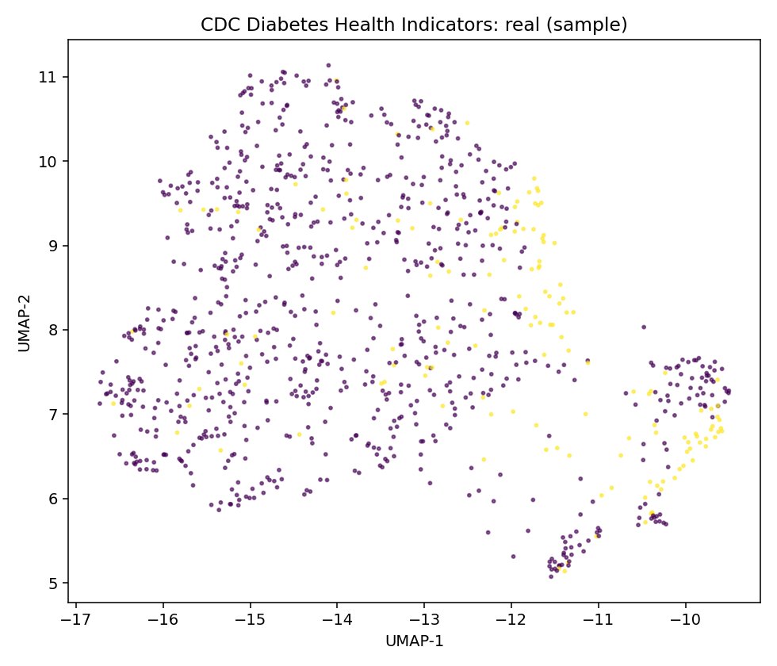
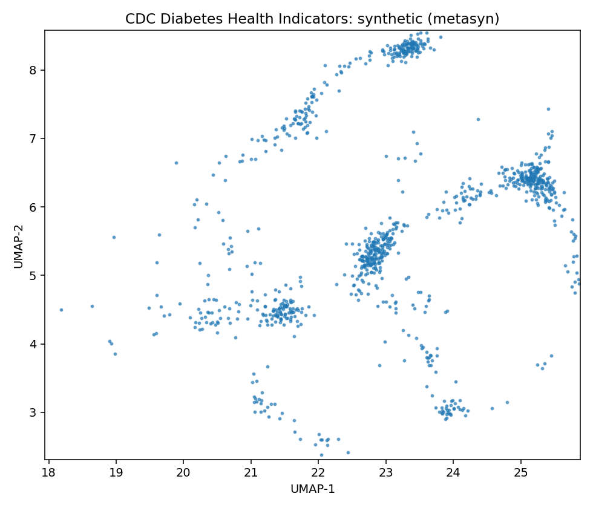
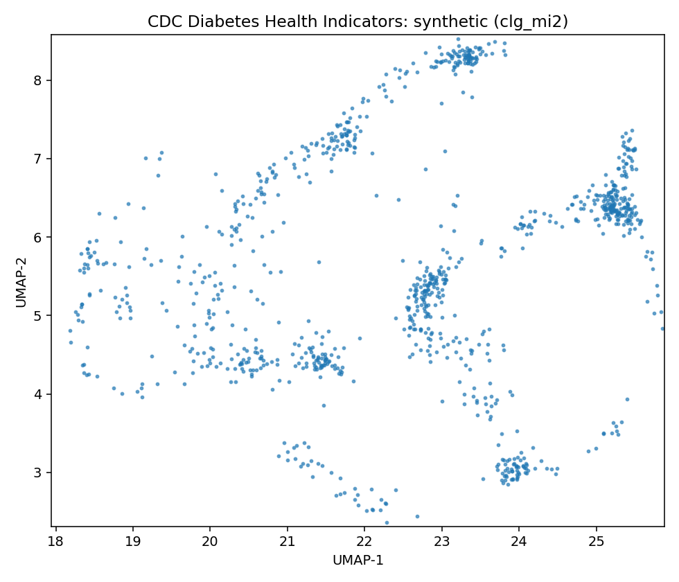
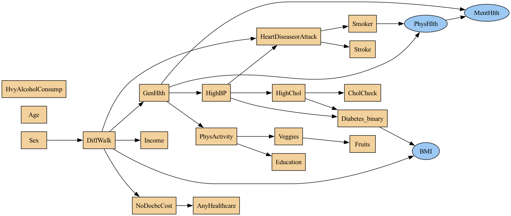
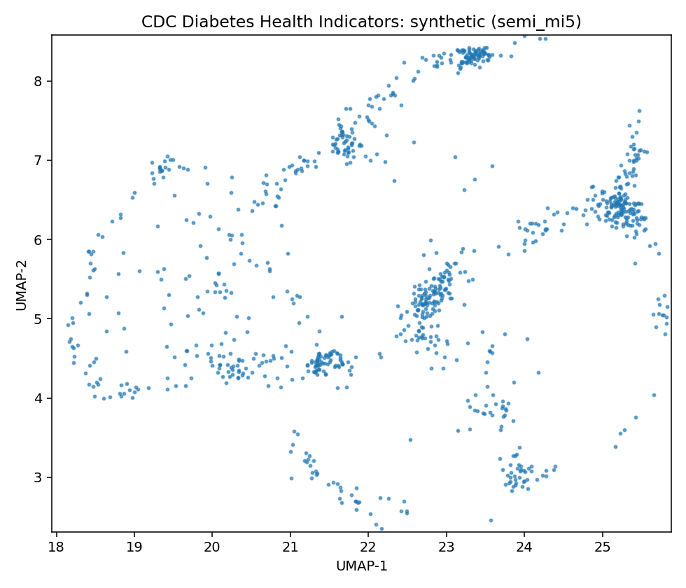
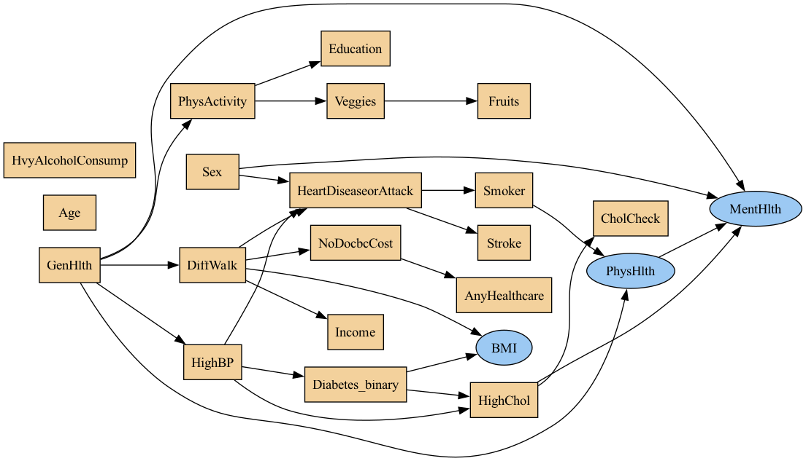

# Data Report — CDC Diabetes Health Indicators

**Source**: [UCI dataset 891](https://archive.ics.uci.edu/dataset/891)

- SemMap JSON-LD: [dataset.semmap.json](dataset.semmap.json)
- SemMap HTML: [dataset.semmap.html](dataset.semmap.html)
- Rows: 253680
- Columns: 22
- Discrete: 19  |  Continuous: 3

## Variables and summary

| variable             | inferred   | dist                                  |
|:---------------------|:-----------|:--------------------------------------|
| HighBP               | discrete   | 108829 (42.90%)                       |
| HighChol             | discrete   | 107591 (42.41%)                       |
| CholCheck            | discrete   | 244210 (96.27%)                       |
| BMI                  | continuous | 28.3824 ± 6.6087 [12, 24, 27, 31, 98] |
| Smoker               | discrete   | 112423 (44.32%)                       |
| Stroke               | discrete   | 10292 (4.06%)                         |
| HeartDiseaseorAttack | discrete   | 23893 (9.42%)                         |
| PhysActivity         | discrete   | 191920 (75.65%)                       |
| Fruits               | discrete   | 160898 (63.43%)                       |
| Veggies              | discrete   | 205841 (81.14%)                       |
| HvyAlcoholConsump    | discrete   | 14256 (5.62%)                         |
| AnyHealthcare        | discrete   | 241263 (95.11%)                       |
| NoDocbcCost          | discrete   | 21354 (8.42%)                         |
| GenHlth              | discrete   | 2: 89084 (35.12%)                     |
|                      |            | 3: 75646 (29.82%)                     |
|                      |            | 1: 45299 (17.86%)                     |
|                      |            | 4: 31570 (12.44%)                     |
|                      |            | 5: 12081 (4.76%)                      |
| MentHlth             | continuous | 3.1848 ± 7.4128 [0, 0, 0, 2, 30]      |
| PhysHlth             | continuous | 4.2421 ± 8.7180 [0, 0, 0, 3, 30]      |
| DiffWalk             | discrete   | 42675 (16.82%)                        |
| Sex                  | discrete   | 111706 (44.03%)                       |
| Age                  | discrete   | 9: 33244 (13.10%)                     |
|                      |            | 10: 32194 (12.69%)                    |
|                      |            | 8: 30832 (12.15%)                     |
|                      |            | 7: 26314 (10.37%)                     |
|                      |            | 11: 23533 (9.28%)                     |
|                      |            | 6: 19819 (7.81%)                      |
|                      |            | 13: 17363 (6.84%)                     |
|                      |            | 5: 16157 (6.37%)                      |
|                      |            | 12: 15980 (6.30%)                     |
|                      |            | 4: 13823 (5.45%)                      |
|                      |            | … (+3 more)                           |
| Education            | discrete   | 6: 107325 (42.31%)                    |
|                      |            | 5: 69910 (27.56%)                     |
|                      |            | 4: 62750 (24.74%)                     |
|                      |            | 3: 9478 (3.74%)                       |
|                      |            | 2: 4043 (1.59%)                       |
|                      |            | 1: 174 (0.07%)                        |
| Income               | discrete   | 8: 90385 (35.63%)                     |
|                      |            | 7: 43219 (17.04%)                     |
|                      |            | 6: 36470 (14.38%)                     |
|                      |            | 5: 25883 (10.20%)                     |
|                      |            | 4: 20135 (7.94%)                      |
|                      |            | 3: 15994 (6.30%)                      |
|                      |            | 2: 11783 (4.64%)                      |
|                      |            | 1: 9811 (3.87%)                       |
| Diabetes_binary      | discrete   | 35346 (13.93%)                        |

## Fidelity summary

| model    | backend   |   disc_jsd_mean |   disc_jsd_median |   cont_ks_mean |   cont_w1_mean |
|:---------|:----------|----------------:|------------------:|---------------:|---------------:|
| metasyn  | metasyn   |          0.0429 |            0.0336 |          0.468 |         2.3811 |
| clg_mi2  | pybnesian |          0.0378 |            0.0296 |          0.267 |         2.9337 |
| semi_mi5 | pybnesian |          0.0374 |            0.0296 |          0.269 |         2.9477 |

## Models

<table>
<tr><th>UMAP</th><th>Details</th><th>Structure</th></tr>
<tr><td></td><td><h3>Real data</h3></td><td></td></tr>
<tr><td>
</td><td>

<h3>Model: metasyn (metasyn)</h3>
<ul>
<li>Seed: 42, rows: 1000</li>
<li><a href="models/metasyn/synthetic.csv">Synthetic CSV</a></li>
<li><a href="models/metasyn/per_variable_metrics.csv">Per-variable metrics</a></li>
<li><a href="models/metasyn/metrics.json">Metrics JSON</a></li>
</ul></td><td>

</td></tr>

<tr><td>
</td><td>

<h3>Model: clg_mi2 (pybnesian)</h3>
<ul>
<li>Seed: 42, rows: 1000</li>
<li>Params: <code>{"max_indegree": 2, "operators": ["arcs"], "score": "bic", "type": "clg"}</code></li>
<li><a href="models/clg_mi2/synthetic.csv">Synthetic CSV</a></li>
<li><a href="models/clg_mi2/per_variable_metrics.csv">Per-variable metrics</a></li>
<li><a href="models/clg_mi2/metrics.json">Metrics JSON</a></li>
</ul></td><td>

</td></tr>

<tr><td>
</td><td>

<h3>Model: semi_mi5 (pybnesian)</h3>
<ul>
<li>Seed: 42, rows: 1000</li>
<li>Params: <code>{"max_indegree": 5, "operators": ["arcs"], "score": "bic", "type": "semiparametric"}</code></li>
<li><a href="models/semi_mi5/synthetic.csv">Synthetic CSV</a></li>
<li><a href="models/semi_mi5/per_variable_metrics.csv">Per-variable metrics</a></li>
<li><a href="models/semi_mi5/metrics.json">Metrics JSON</a></li>
</ul></td><td>

</td></tr>

<table>

