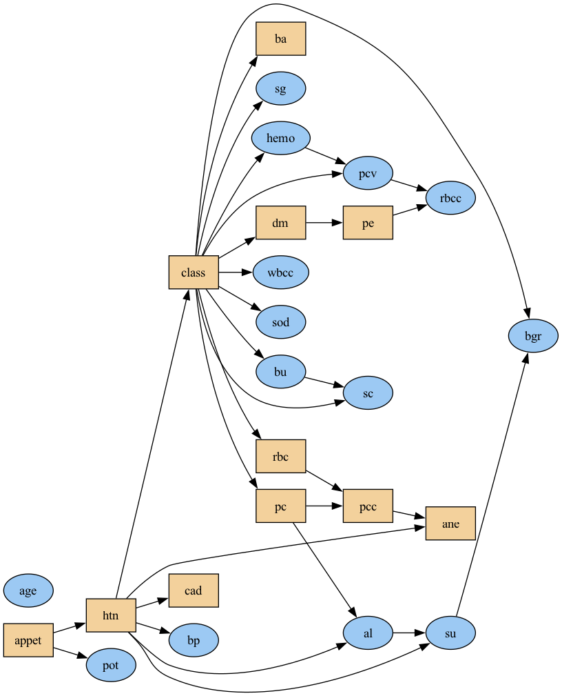
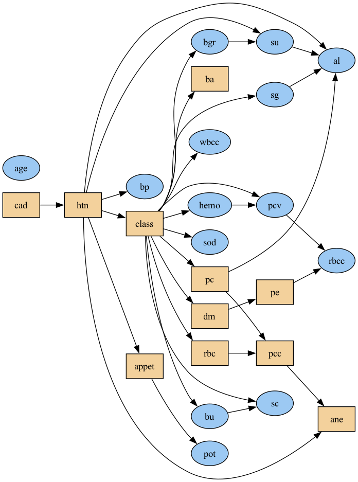
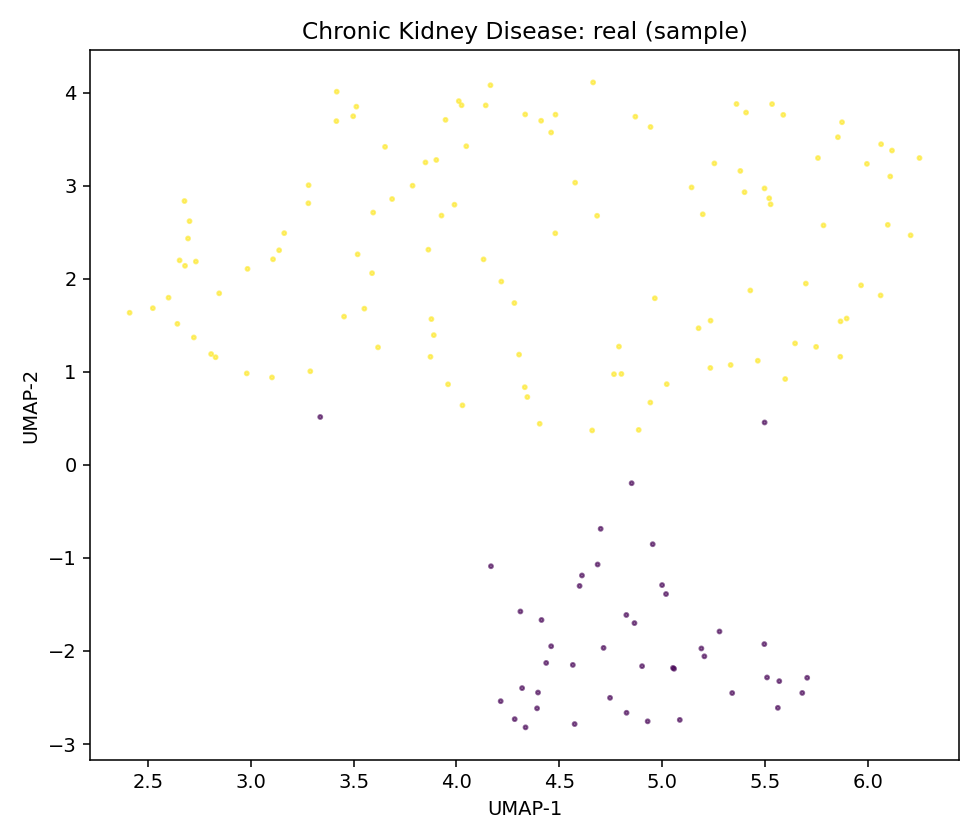
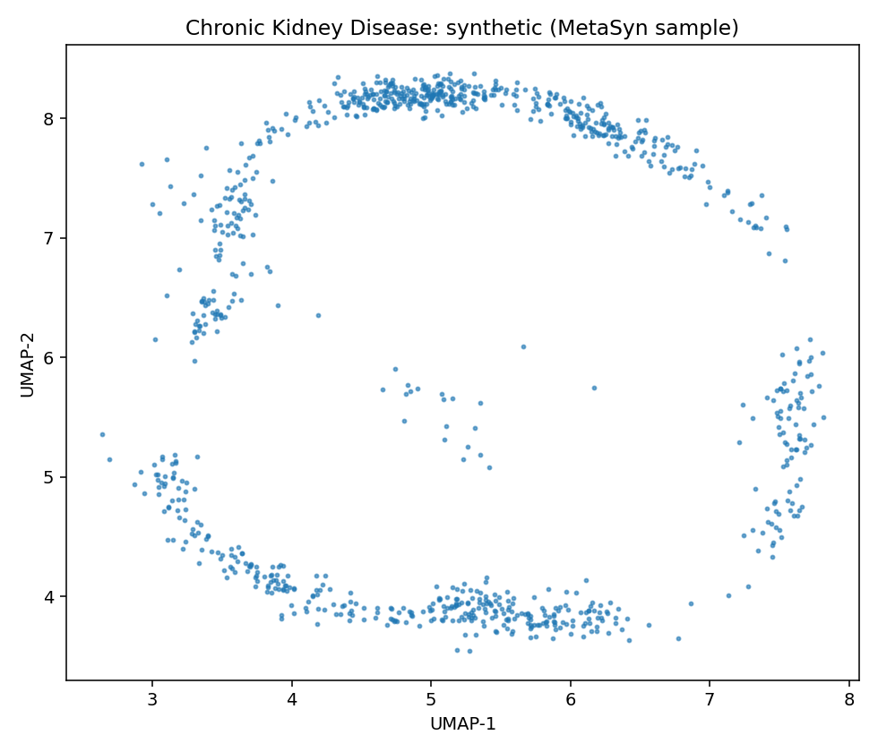
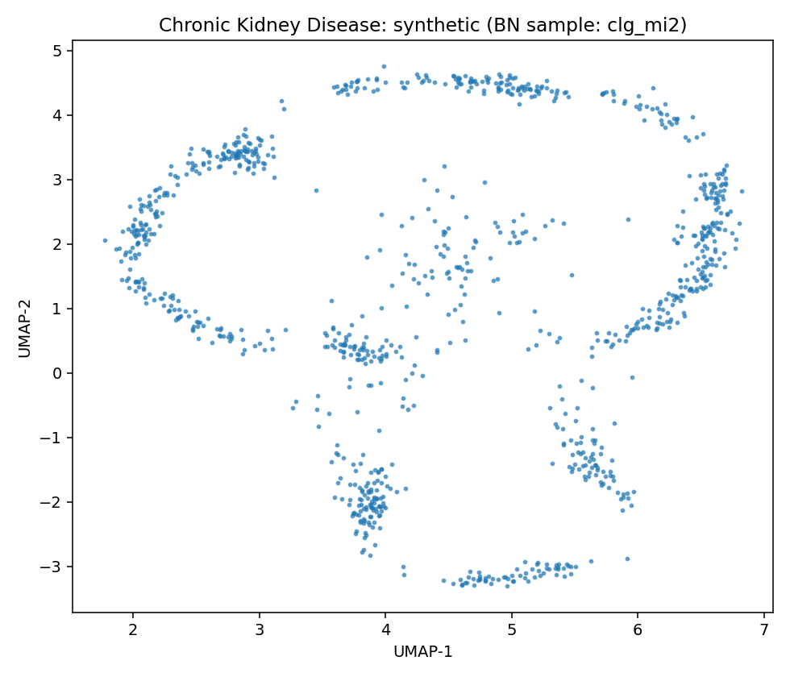
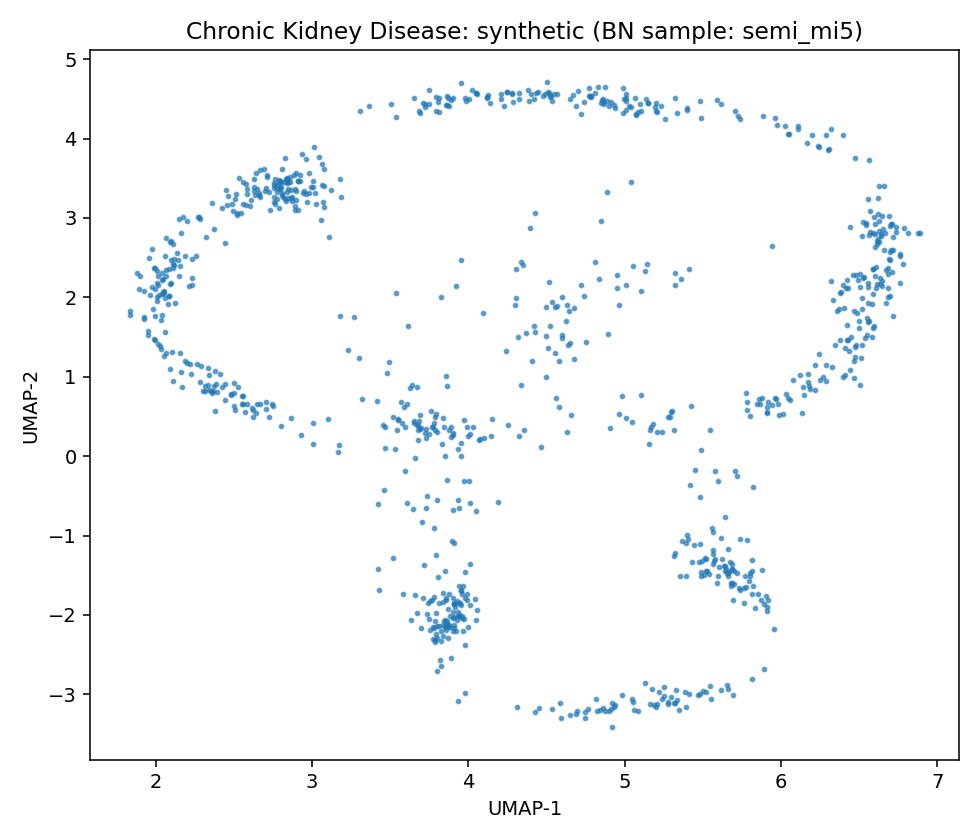

# Data Report — Chronic Kidney Disease

**Source**: [UCI dataset 336](https://archive.ics.uci.edu/dataset/336)

- Metadata file: [metadata.json](metadata.json)
- JSON-LD (schema.org/Dataset): [dataset.json](dataset.json)
- Rows: 158
- Columns: 25
- Discrete: 11  |  Continuous: 14

## Dataset metadata

### Description

This dataset can be used to predict the chronic kidney disease and it can be collected from the hospital nearly 2 months of period.

- Creators: L. Rubini, P. Soundarapandian, P. Eswaran
- Links:
  - URL: https://archive.ics.uci.edu/dataset/336
## Variables and summary

| variable   | description             | inferred   | declared    |   count | unique   | top        | freq   | mean                | std                  | min    | 25%    | 50%                | 75%    | max     |
|:-----------|:------------------------|:-----------|:------------|--------:|:---------|:-----------|:-------|:--------------------|:---------------------|:-------|:-------|:-------------------|:-------|:--------|
| age        |                         | continuous | Integer     |     391 |          |            |        | 51.48337595907928   | 17.16971408926224    | 2.0    | 42.0   | 55.0               | 64.5   | 90.0    |
| bp         | blood pressure          | continuous | Integer     |     388 |          |            |        | 76.46907216494846   | 13.683637493525255   | 50.0   | 70.0   | 80.0               | 80.0   | 180.0   |
| sg         | specific gravity        | continuous | Categorical |     353 |          |            |        | 1.0174079320113314  | 0.005716616974376362 | 1.005  | 1.01   | 1.02               | 1.02   | 1.025   |
| al         | albumin                 | continuous | Categorical |     354 |          |            |        | 1.0169491525423728  | 1.3526789127628434   | 0.0    | 0.0    | 0.0                | 2.0    | 5.0     |
| su         | sugar                   | continuous | Categorical |     351 |          |            |        | 0.45014245014245013 | 1.099191251885409    | 0.0    | 0.0    | 0.0                | 0.0    | 5.0     |
| rbc        | red blood cells         | discrete   | Binary      |     248 | 2        | normal     | 201    |                     |                      |        |        |                    |        |         |
| pc         | pus cell                | discrete   | Binary      |     335 | 2        | normal     | 259    |                     |                      |        |        |                    |        |         |
| pcc        | pus cell clumps         | discrete   | Binary      |     396 | 2        | notpresent | 354    |                     |                      |        |        |                    |        |         |
| ba         | bacteria                | discrete   | Binary      |     396 | 2        | notpresent | 374    |                     |                      |        |        |                    |        |         |
| bgr        | blood glucose random    | continuous | Integer     |     356 |          |            |        | 148.0365168539326   | 79.28171423511776    | 22.0   | 99.0   | 121.0              | 163.0  | 490.0   |
| bu         | blood urea              | continuous | Integer     |     381 |          |            |        | 57.425721784776904  | 50.5030058492225     | 1.5    | 27.0   | 42.0               | 66.0   | 391.0   |
| sc         | serum creatinine        | continuous | Continuous  |     383 |          |            |        | 3.072454308093995   | 5.741126066859781    | 0.4    | 0.9    | 1.3                | 2.8    | 76.0    |
| sod        | sodium                  | continuous | Integer     |     313 |          |            |        | 137.52875399361022  | 10.408752051798789   | 4.5    | 135.0  | 138.0              | 142.0  | 163.0   |
| pot        | potassium               | continuous | Continuous  |     312 |          |            |        | 4.62724358974359    | 3.1939041765566967   | 2.5    | 3.8    | 4.4                | 4.9    | 47.0    |
| hemo       | hemoglobin              | continuous | Continuous  |     348 |          |            |        | 12.526436781609195  | 2.9125866088267647   | 3.1    | 10.3   | 12.649999999999999 | 15.0   | 17.8    |
| pcv        | packed cell volume      | continuous | Integer     |     329 |          |            |        | 38.88449848024316   | 8.990104814740938    | 9.0    | 32.0   | 40.0               | 45.0   | 54.0    |
| wbcc       | white blood cell count  | continuous | Integer     |     294 |          |            |        | 8406.122448979591   | 2944.474190410339    | 2200.0 | 6500.0 | 8000.0             | 9800.0 | 26400.0 |
| rbcc       | red blood cell count    | continuous | Continuous  |     269 |          |            |        | 4.707434944237917   | 1.0253232655721793   | 2.1    | 3.9    | 4.8                | 5.4    | 8.0     |
| htn        | hypertension            | discrete   | Binary      |     398 | 2        | no         | 251    |                     |                      |        |        |                    |        |         |
| dm         | diabetes mellitus       | discrete   | Binary      |     398 | 3        | no         | 260    |                     |                      |        |        |                    |        |         |
| cad        | coronary artery disease | discrete   | Binary      |     398 | 2        | no         | 364    |                     |                      |        |        |                    |        |         |
| appet      | appetite                | discrete   | Binary      |     399 | 2        | good       | 317    |                     |                      |        |        |                    |        |         |
| pe         | pedal edema             | discrete   | Binary      |     399 | 2        | no         | 323    |                     |                      |        |        |                    |        |         |
| ane        | anemia                  | discrete   | Binary      |     399 | 2        | no         | 339    |                     |                      |        |        |                    |        |         |
| class      | ckd or not ckd          | discrete   | Binary      |     400 | 3        | ckd        | 248    |                     |                      |        |        |                    |        |         |

## Learned structures and configurations

MetaSyn GMF: [metasyn_gmf.json](metasyn_gmf.json)

### Arc blacklist

- Root variables: age
- Forbidden arc count: 25

### clg_mi2

| param        | value    |
|:-------------|:---------|
| bn_type      | clg      |
| score        | bic      |
| operators    | ['arcs'] |
| max_indegree | 2        |
| seed         | 42       |

Serialization

- Structure (GraphML): [structure_clg_mi2.graphml](structure_clg_mi2.graphml)
- Full model (pickle): [model_clg_mi2.pickle](model_clg_mi2.pickle)

### semi_mi5

| param        | value          |
|:-------------|:---------------|
| bn_type      | semiparametric |
| score        | bic            |
| operators    | ['arcs']       |
| max_indegree | 5              |
| seed         | 42             |

Serialization

- Structure (GraphML): [structure_semi_mi5.graphml](structure_semi_mi5.graphml)
- Full model (pickle): [model_semi_mi5.pickle](model_semi_mi5.pickle)

## Fidelity (BN vs MetaSyn)

| model       | mean_loglik   | std_loglik   | sum_loglik   |   disc_jsd_mean |   disc_jsd_median |   cont_ks_mean |   cont_w1_mean |
|:------------|:--------------|:-------------|:-------------|----------------:|------------------:|---------------:|---------------:|
| BN:clg_mi2  | -104.6927     | 390.3084     | -3350.165    |          0.0474 |            0.0556 |         0.2277 |        43.5847 |
| BN:semi_mi5 | -104.1037     | 390.4267     | -3331.317    |          0.048  |            0.0571 |         0.2266 |        43.5115 |
| MetaSyn     |               |              |              |          0.0439 |            0.0366 |         0.2971 |        42.9851 |

### Per-variable distances (lower is closer)

<table class="dataframe table per-var-dist">
  <thead>
    <tr>
      <th colspan="2" halign="left"></th>
      <th colspan="3" halign="left">JSD</th>
      <th colspan="3" halign="left">KS</th>
      <th colspan="3" halign="left">W1</th>
    </tr>
    <tr>
      <th>variable</th>
      <th>type</th>
      <th>clg_mi2</th>
      <th>semi_mi5</th>
      <th>MetaSyn</th>
      <th>clg_mi2</th>
      <th>semi_mi5</th>
      <th>MetaSyn</th>
      <th>clg_mi2</th>
      <th>semi_mi5</th>
      <th>MetaSyn</th>
    </tr>
  </thead>
  <tbody>
    <tr>
      <td>age</td>
      <td>continuous</td>
      <td></td>
      <td></td>
      <td></td>
      <td>0.1190</td>
      <td>0.1190</td>
      <td>0.1290</td>
      <td>2.4896</td>
      <td>2.4896</td>
      <td>2.6733</td>
    </tr>
    <tr>
      <td>al</td>
      <td>continuous</td>
      <td></td>
      <td></td>
      <td></td>
      <td>0.2685</td>
      <td>0.2685</td>
      <td>0.2515</td>
      <td>3.9719</td>
      <td>3.9719</td>
      <td>3.8294</td>
    </tr>
    <tr>
      <td>ane</td>
      <td>discrete</td>
      <td></td>
      <td></td>
      <td></td>
      <td>0.2902</td>
      <td>0.2842</td>
      <td>0.4062</td>
      <td>0.0018</td>
      <td>0.0018</td>
      <td>0.0018</td>
    </tr>
    <tr>
      <td>appet</td>
      <td>discrete</td>
      <td></td>
      <td></td>
      <td></td>
      <td>0.4048</td>
      <td>0.3828</td>
      <td>0.7188</td>
      <td>0.3551</td>
      <td>0.3544</td>
      <td>0.6631</td>
    </tr>
    <tr>
      <td>ba</td>
      <td>discrete</td>
      <td></td>
      <td></td>
      <td></td>
      <td>0.5385</td>
      <td>0.5465</td>
      <td>0.9375</td>
      <td>0.3201</td>
      <td>0.2672</td>
      <td>0.2766</td>
    </tr>
    <tr>
      <td>bgr</td>
      <td>continuous</td>
      <td>0.0413</td>
      <td>0.0413</td>
      <td>0.0269</td>
      <td></td>
      <td></td>
      <td></td>
      <td></td>
      <td></td>
      <td></td>
    </tr>
    <tr>
      <td>bp</td>
      <td>continuous</td>
      <td>0.0725</td>
      <td>0.0803</td>
      <td>0.0780</td>
      <td></td>
      <td></td>
      <td></td>
      <td></td>
      <td></td>
      <td></td>
    </tr>
    <tr>
      <td>bu</td>
      <td>continuous</td>
      <td>0.0599</td>
      <td>0.0571</td>
      <td>0.0366</td>
      <td></td>
      <td></td>
      <td></td>
      <td></td>
      <td></td>
      <td></td>
    </tr>
    <tr>
      <td>cad</td>
      <td>discrete</td>
      <td>0.0927</td>
      <td>0.0927</td>
      <td>0.0997</td>
      <td></td>
      <td></td>
      <td></td>
      <td></td>
      <td></td>
      <td></td>
    </tr>
    <tr>
      <td>class</td>
      <td>discrete</td>
      <td></td>
      <td></td>
      <td></td>
      <td>0.1680</td>
      <td>0.1720</td>
      <td>0.2750</td>
      <td>20.7643</td>
      <td>19.8176</td>
      <td>22.0449</td>
    </tr>
    <tr>
      <td>dm</td>
      <td>discrete</td>
      <td></td>
      <td></td>
      <td></td>
      <td>0.2418</td>
      <td>0.2418</td>
      <td>0.1908</td>
      <td>8.1714</td>
      <td>8.1714</td>
      <td>12.5436</td>
    </tr>
    <tr>
      <td>hemo</td>
      <td>continuous</td>
      <td></td>
      <td></td>
      <td></td>
      <td>0.2545</td>
      <td>0.2545</td>
      <td>0.2690</td>
      <td>0.4459</td>
      <td>0.4459</td>
      <td>0.8839</td>
    </tr>
    <tr>
      <td>htn</td>
      <td>discrete</td>
      <td></td>
      <td></td>
      <td></td>
      <td>0.1828</td>
      <td>0.1812</td>
      <td>0.2047</td>
      <td>2.2833</td>
      <td>2.4015</td>
      <td>2.3510</td>
    </tr>
    <tr>
      <td>pc</td>
      <td>discrete</td>
      <td></td>
      <td></td>
      <td></td>
      <td>0.1562</td>
      <td>0.1562</td>
      <td>0.1305</td>
      <td>1.5038</td>
      <td>1.5038</td>
      <td>1.4793</td>
    </tr>
    <tr>
      <td>pcc</td>
      <td>discrete</td>
      <td></td>
      <td></td>
      <td></td>
      <td>0.1015</td>
      <td>0.0880</td>
      <td>0.1615</td>
      <td>0.4363</td>
      <td>0.4297</td>
      <td>0.6653</td>
    </tr>
    <tr>
      <td>pcv</td>
      <td>continuous</td>
      <td></td>
      <td></td>
      <td></td>
      <td>0.1922</td>
      <td>0.2023</td>
      <td>0.1902</td>
      <td>2.0029</td>
      <td>1.8681</td>
      <td>2.2576</td>
    </tr>
    <tr>
      <td>pe</td>
      <td>discrete</td>
      <td></td>
      <td></td>
      <td></td>
      <td>0.1612</td>
      <td>0.1612</td>
      <td>0.1742</td>
      <td>567.2351</td>
      <td>567.2351</td>
      <td>551.8974</td>
    </tr>
    <tr>
      <td>pot</td>
      <td>continuous</td>
      <td></td>
      <td></td>
      <td></td>
      <td>0.1088</td>
      <td>0.1138</td>
      <td>0.1198</td>
      <td>0.2039</td>
      <td>0.2024</td>
      <td>0.2247</td>
    </tr>
    <tr>
      <td>rbc</td>
      <td>discrete</td>
      <td>0.0074</td>
      <td>0.0074</td>
      <td>0.0059</td>
      <td></td>
      <td></td>
      <td></td>
      <td></td>
      <td></td>
      <td></td>
    </tr>
    <tr>
      <td>rbcc</td>
      <td>continuous</td>
      <td>0.0093</td>
      <td>0.0093</td>
      <td>0.0160</td>
      <td></td>
      <td></td>
      <td></td>
      <td></td>
      <td></td>
      <td></td>
    </tr>
    <tr>
      <td>sc</td>
      <td>continuous</td>
      <td>0.1037</td>
      <td>0.1037</td>
      <td>0.1008</td>
      <td></td>
      <td></td>
      <td></td>
      <td></td>
      <td></td>
      <td></td>
    </tr>
    <tr>
      <td>sg</td>
      <td>continuous</td>
      <td>0.0607</td>
      <td>0.0607</td>
      <td>0.0447</td>
      <td></td>
      <td></td>
      <td></td>
      <td></td>
      <td></td>
      <td></td>
    </tr>
    <tr>
      <td>sod</td>
      <td>continuous</td>
      <td>0.0163</td>
      <td>0.0163</td>
      <td>0.0126</td>
      <td></td>
      <td></td>
      <td></td>
      <td></td>
      <td></td>
      <td></td>
    </tr>
    <tr>
      <td>su</td>
      <td>continuous</td>
      <td>0.0556</td>
      <td>0.0571</td>
      <td>0.0511</td>
      <td></td>
      <td></td>
      <td></td>
      <td></td>
      <td></td>
      <td></td>
    </tr>
    <tr>
      <td>wbcc</td>
      <td>continuous</td>
      <td>0.0017</td>
      <td>0.0017</td>
      <td>0.0101</td>
      <td></td>
      <td></td>
      <td></td>
      <td></td>
      <td></td>
      <td></td>
    </tr>
  </tbody>
</table>

## UMAP overview (same projection)

| Real (sample) | MetaSyn (synthetic) | BN: clg_mi2 | BN: semi_mi5 |
| --- | --- | --- | --- |
|  |  |  |  |

