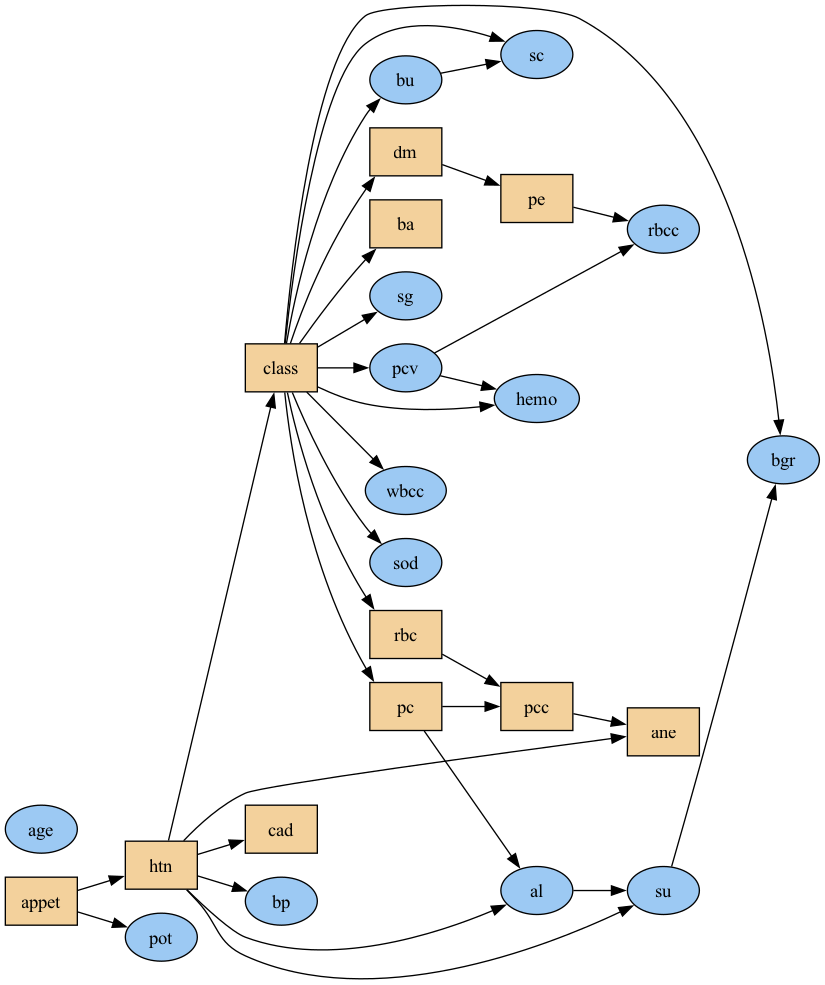
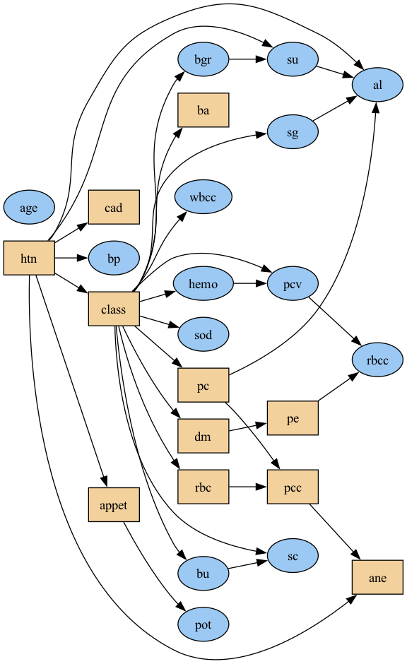
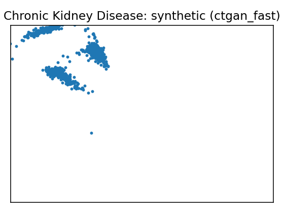
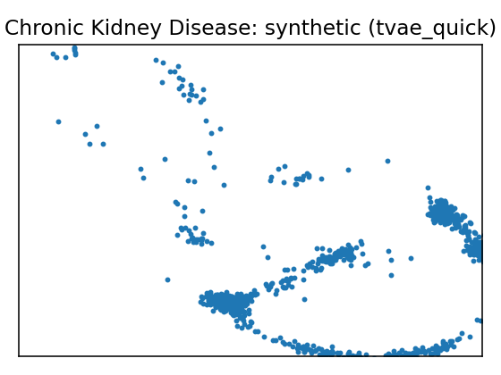

# Data Report — Chronic Kidney Disease

**Source**: [UCI dataset 336](https://archive.ics.uci.edu/dataset/336)

- Metadata file: [metadata.json](metadata.json)
- JSON-LD (schema.org/Dataset): [dataset.json](dataset.json)
- SemMap JSON-LD: [dataset.semmap.json](dataset.semmap.json)
- SemMap HTML: [dataset.semmap.html](dataset.semmap.html)
- Rows: 158
- Columns: 25
- Discrete: 11  |  Continuous: 14

## Dataset metadata

- Name: Chronic Kidney Disease (UCI id 336)

### Description

Clinical records for early detection of CKD (subset of variables mapped).

- Links:
  - URL: https://archive.ics.uci.edu/dataset/336
## Variables and summary

| variable   | description             | inferred   | declared    | dist                                                  |
|:-----------|:------------------------|:-----------|:------------|:------------------------------------------------------|
| age        |                         | continuous | Integer     | 49.5633 ± 15.5122 [6, 39.25, 50.5, 60, 83]            |
| bp         | blood pressure          | continuous | Integer     | 74.0506 ± 11.1754 [50, 60, 80, 80, 110]               |
| sg         | specific gravity        | continuous | Categorical | 1.0199 ± 0.0055 [1.005, 1.02, 1.02, 1.025, 1.025]     |
| al         | albumin                 | continuous | Categorical | 0.7975 ± 1.4131 [0, 0, 0, 1, 4]                       |
| su         | sugar                   | continuous | Categorical | 0.2532 ± 0.8134 [0, 0, 0, 0, 5]                       |
| rbc        | red blood cells         | discrete   | Binary      | 140 (88.61%)                                          |
| pc         | pus cell                | discrete   | Binary      | 129 (81.65%)                                          |
| pcc        | pus cell clumps         | discrete   | Binary      | 144 (91.14%)                                          |
| ba         | bacteria                | discrete   | Binary      | 146 (92.41%)                                          |
| bgr        | blood glucose random    | continuous | Integer     | 131.3418 ± 64.9398 [70, 97, 115.5, 131.75, 490]       |
| bu         | blood urea              | continuous | Integer     | 52.5759 ± 47.3954 [10, 26, 39.5, 49.75, 309]          |
| sc         | serum creatinine        | continuous | Continuous  | 2.1886 ± 3.0776 [0.4, 0.7, 1.1, 1.6, 15.2]            |
| sod        | sodium                  | continuous | Integer     | 138.8481 ± 7.4894 [111, 135, 139, 144, 150]           |
| pot        | potassium               | continuous | Continuous  | 4.6367 ± 3.4764 [2.5, 3.7, 4.5, 4.9, 47]              |
| hemo       | hemoglobin              | continuous | Continuous  | 13.6873 ± 2.8822 [3.1, 12.6, 14.25, 15.775, 17.8]     |
| pcv        | packed cell volume      | continuous | Integer     | 41.9177 ± 9.1052 [9, 37.5, 44, 48, 54]                |
| wbcc       | white blood cell count  | continuous | Integer     | 8475.9494 ± 3126.8802 [3800, 6525, 7800, 9775, 26400] |
| rbcc       | red blood cell count    | continuous | Continuous  | 4.8918 ± 1.0194 [2.1, 4.5, 4.95, 5.6, 8]              |
| htn        | hypertension            | discrete   | Binary      | 34 (21.52%)                                           |
| dm         | diabetes mellitus       | discrete   | Binary      | 28 (17.72%)                                           |
| cad        | coronary artery disease | discrete   | Binary      | 11 (6.96%)                                            |
| appet      | appetite                | discrete   | Binary      | 139 (87.97%)                                          |
| pe         | pedal edema             | discrete   | Binary      | 20 (12.66%)                                           |
| ane        | anemia                  | discrete   | Binary      | 16 (10.13%)                                           |
| class      | ckd or not ckd          | discrete   | Binary      | 115 (72.78%)                                          |

## Fidelity summary

| model      | backend   |   disc_jsd_mean |   disc_jsd_median |   cont_ks_mean |   cont_w1_mean |
|:-----------|:----------|----------------:|------------------:|---------------:|---------------:|
| MetaSyn    | metasyn   |          0.0398 |            0.035  |         0.301  |        43.6132 |
| clg_mi2    | pybnesian |          0.0544 |            0.0502 |         0.2405 |        49.3847 |
| semi_mi5   | pybnesian |          0.0419 |            0.0411 |         0.2446 |        59.6372 |
| ctgan_fast | synthcity |          0.1475 |            0.1492 |         0.6607 |       880.088  |
| tvae_quick | synthcity |          0.1676 |            0.1862 |         0.2515 |        74.6213 |

## Models

<table>
<tr><th>UMAP</th><th>Details</th><th>Structure</th></tr>
<tr><td></td><td><h3>Real data</h3></td><td></td></tr>
<tr><td></td><td>

<h3>MetaSyn</h3>
<ul>
<li>GMF: <a href="metasyn_gmf.json">metasyn_gmf.json</a></li>
<li>Synthetic sample (SemMap Parquet): <a href="synthetic_metasyn.semmap.parquet">synthetic_metasyn.semmap.parquet</a></li>
</ul></td><td></td></tr>
<tr><td>
</td><td>

<h3>Model: clg_mi2 (pybnesian)</h3>
<ul>
<li>Seed: 42, rows: 126</li>
<li>Params: <code>{"max_indegree": 2, "operators": ["arcs"], "score": "bic", "type": "clg"}</code></li>
<li><a href="models/clg_mi2/synthetic.csv">Synthetic CSV</a></li>
<li><a href="models/clg_mi2/per_variable_metrics.csv">Per-variable metrics</a></li>
<li><a href="models/clg_mi2/metrics.json">Metrics JSON</a></li>
</ul></td><td>

</td></tr>

<tr><td>
</td><td>

<h3>Model: semi_mi5 (pybnesian)</h3>
<ul>
<li>Seed: 42, rows: 126</li>
<li>Params: <code>{"max_indegree": 5, "operators": ["arcs"], "score": "bic", "type": "semiparametric"}</code></li>
<li><a href="models/semi_mi5/synthetic.csv">Synthetic CSV</a></li>
<li><a href="models/semi_mi5/per_variable_metrics.csv">Per-variable metrics</a></li>
<li><a href="models/semi_mi5/metrics.json">Metrics JSON</a></li>
</ul></td><td>

</td></tr>

<tr><td>
</td><td>

<h3>Model: ctgan_fast (synthcity)</h3>
<ul>
<li>Seed: 42, rows: 1000</li>
<li>Params: <code>{"batch_size": 256, "n_iter": 5}</code></li>
<li><a href="models/ctgan_fast/synthetic.csv">Synthetic CSV</a></li>
<li><a href="models/ctgan_fast/per_variable_metrics.csv">Per-variable metrics</a></li>
<li><a href="models/ctgan_fast/metrics.json">Metrics JSON</a></li>
</ul></td><td>

</td></tr>

<tr><td>
</td><td>

<h3>Model: tvae_quick (synthcity)</h3>
<ul>
<li>Seed: 42, rows: 1000</li>
<li>Params: <code>{"batch_size": 256}</code></li>
<li><a href="models/tvae_quick/synthetic.csv">Synthetic CSV</a></li>
<li><a href="models/tvae_quick/per_variable_metrics.csv">Per-variable metrics</a></li>
<li><a href="models/tvae_quick/metrics.json">Metrics JSON</a></li>
</ul></td><td>

</td></tr>

<table>

