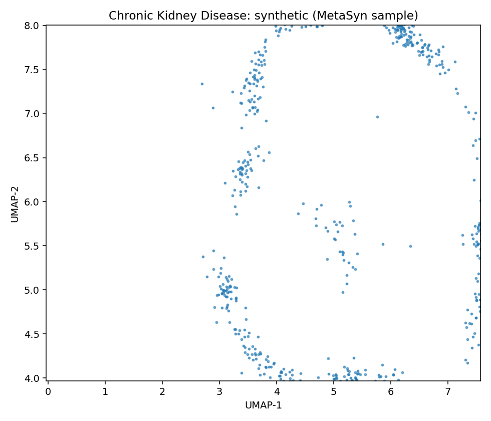
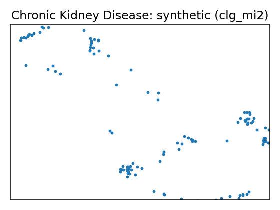
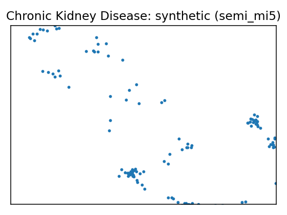

# Data Report — Chronic Kidney Disease

**Source**: [UCI dataset 336](https://archive.ics.uci.edu/dataset/336)

- Metadata file: [metadata.json](metadata.json)
- JSON-LD (schema.org/Dataset): [dataset.json](dataset.json)
- Rows: 158
- Columns: 25
- Discrete: 11  |  Continuous: 14

## Dataset metadata

- Links:
  - URL: https://archive.ics.uci.edu/dataset/336
## Variables and summary

| variable   | description             | inferred   | declared    | type       | dist                                                  |
|:-----------|:------------------------|:-----------|:------------|:-----------|:------------------------------------------------------|
| age        |                         | continuous | Integer     | continuous | 49.5633 ± 15.5122 [6, 39.25, 50.5, 60, 83]            |
| bp         | blood pressure          | continuous | Integer     | continuous | 74.0506 ± 11.1754 [50, 60, 80, 80, 110]               |
| sg         | specific gravity        | continuous | Categorical | continuous | 1.0199 ± 0.0055 [1.005, 1.02, 1.02, 1.025, 1.025]     |
| al         | albumin                 | continuous | Categorical | continuous | 0.7975 ± 1.4131 [0, 0, 0, 1, 4]                       |
| su         | sugar                   | continuous | Categorical | continuous | 0.2532 ± 0.8134 [0, 0, 0, 0, 5]                       |
| rbc        | red blood cells         | discrete   | Binary      | discrete   | 140 (88.61%)                                          |
| pc         | pus cell                | discrete   | Binary      | discrete   | 129 (81.65%)                                          |
| pcc        | pus cell clumps         | discrete   | Binary      | discrete   | 144 (91.14%)                                          |
| ba         | bacteria                | discrete   | Binary      | discrete   | 146 (92.41%)                                          |
| bgr        | blood glucose random    | continuous | Integer     | continuous | 131.3418 ± 64.9398 [70, 97, 115.5, 131.75, 490]       |
| bu         | blood urea              | continuous | Integer     | continuous | 52.5759 ± 47.3954 [10, 26, 39.5, 49.75, 309]          |
| sc         | serum creatinine        | continuous | Continuous  | continuous | 2.1886 ± 3.0776 [0.4, 0.7, 1.1, 1.6, 15.2]            |
| sod        | sodium                  | continuous | Integer     | continuous | 138.8481 ± 7.4894 [111, 135, 139, 144, 150]           |
| pot        | potassium               | continuous | Continuous  | continuous | 4.6367 ± 3.4764 [2.5, 3.7, 4.5, 4.9, 47]              |
| hemo       | hemoglobin              | continuous | Continuous  | continuous | 13.6873 ± 2.8822 [3.1, 12.6, 14.25, 15.775, 17.8]     |
| pcv        | packed cell volume      | continuous | Integer     | continuous | 41.9177 ± 9.1052 [9, 37.5, 44, 48, 54]                |
| wbcc       | white blood cell count  | continuous | Integer     | continuous | 8475.9494 ± 3126.8802 [3800, 6525, 7800, 9775, 26400] |
| rbcc       | red blood cell count    | continuous | Continuous  | continuous | 4.8918 ± 1.0194 [2.1, 4.5, 4.95, 5.6, 8]              |
| htn        | hypertension            | discrete   | Binary      | discrete   | 34 (21.52%)                                           |
| dm         | diabetes mellitus       | discrete   | Binary      | discrete   | 28 (17.72%)                                           |
| cad        | coronary artery disease | discrete   | Binary      | discrete   | 11 (6.96%)                                            |
| appet      | appetite                | discrete   | Binary      | discrete   | 139 (87.97%)                                          |
| pe         | pedal edema             | discrete   | Binary      | discrete   | 20 (12.66%)                                           |
| ane        | anemia                  | discrete   | Binary      | discrete   | 16 (10.13%)                                           |
| class      | ckd or not ckd          | discrete   | Binary      | discrete   | 115 (72.78%)                                          |

## Fidelity summary

| model    | backend   |   disc_jsd_mean |   disc_jsd_median |   cont_ks_mean |   cont_w1_mean |
|:---------|:----------|----------------:|------------------:|---------------:|---------------:|
| clg_mi2  | pybnesian |          0.0544 |            0.0502 |         0.2405 |        49.3847 |
| semi_mi5 | pybnesian |          0.0562 |            0.0502 |         0.2191 |        49.0722 |
| MetaSyn  | metasyn   |          0.0467 |            0.0411 |         0.2964 |        43.085  |

## Models

### Model: clg_mi2 (pybnesian)

- Seed: 42
- Rows: 126
- Params: `{"max_indegree": 2, "operators": ["arcs"], "score": "bic", "type": "clg"}`
- Synthetic CSV: [models/clg_mi2/synthetic.csv](models/clg_mi2/synthetic.csv)
- Per-variable metrics: [models/clg_mi2/per_variable_metrics.csv](models/clg_mi2/per_variable_metrics.csv)
- Metrics JSON: [models/clg_mi2/metrics.json](models/clg_mi2/metrics.json)
- UMAP: [umap.png](models/clg_mi2/umap.png)
### Model: semi_mi5 (pybnesian)

- Seed: 42
- Rows: 126
- Params: `{"max_indegree": 5, "operators": ["arcs"], "score": "bic", "type": "semiparametric"}`
- Synthetic CSV: [models/semi_mi5/synthetic.csv](models/semi_mi5/synthetic.csv)
- Per-variable metrics: [models/semi_mi5/per_variable_metrics.csv](models/semi_mi5/per_variable_metrics.csv)
- Metrics JSON: [models/semi_mi5/metrics.json](models/semi_mi5/metrics.json)
- UMAP: [umap.png](models/semi_mi5/umap.png)
MetaSyn GMF: [metasyn_gmf.json](metasyn_gmf.json)

## UMAP overview (same projection)

| Real (sample) | MetaSyn (synthetic) | pybnesian: clg_mi2 | pybnesian: semi_mi5 |
| --- | --- | --- | --- |
|  |  |  |  |

