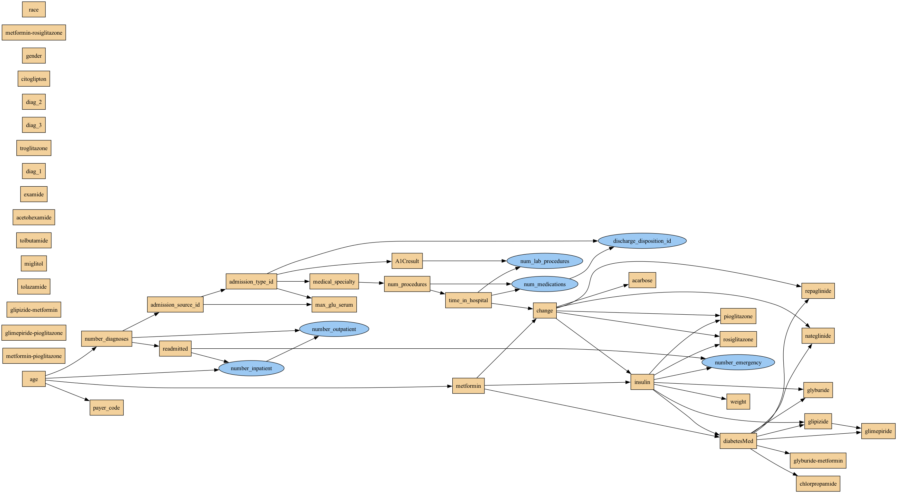
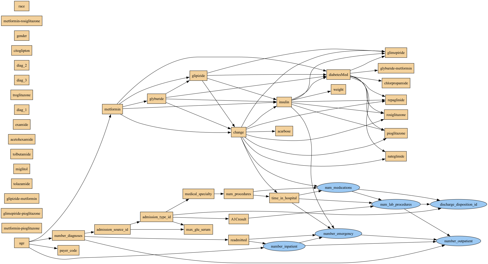
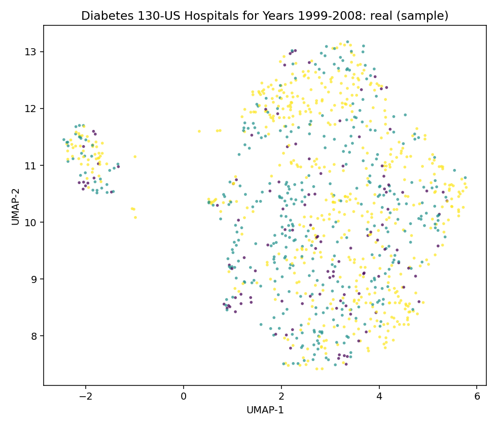
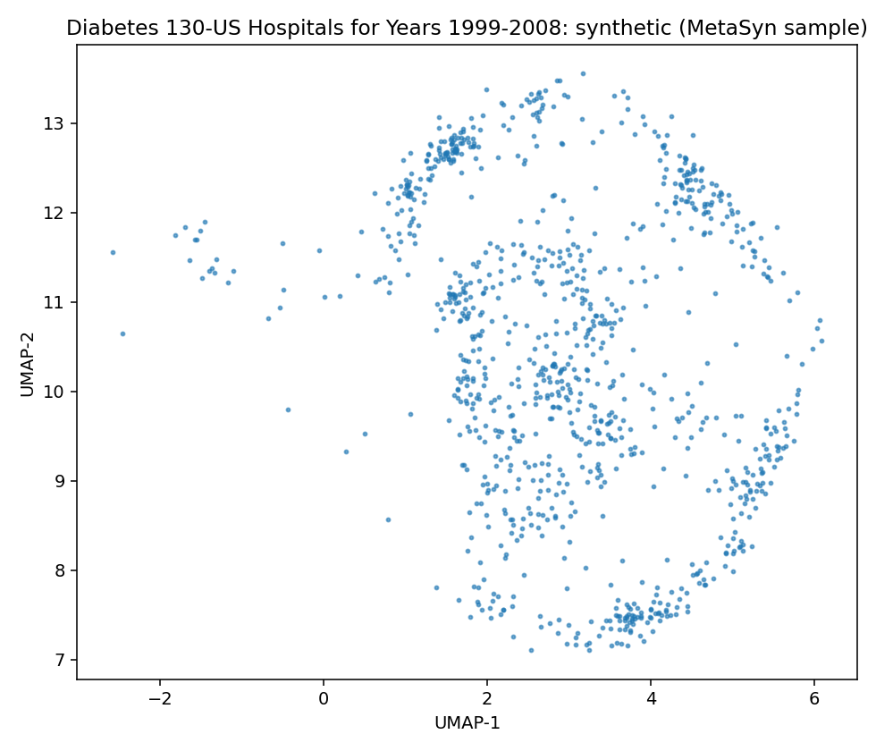
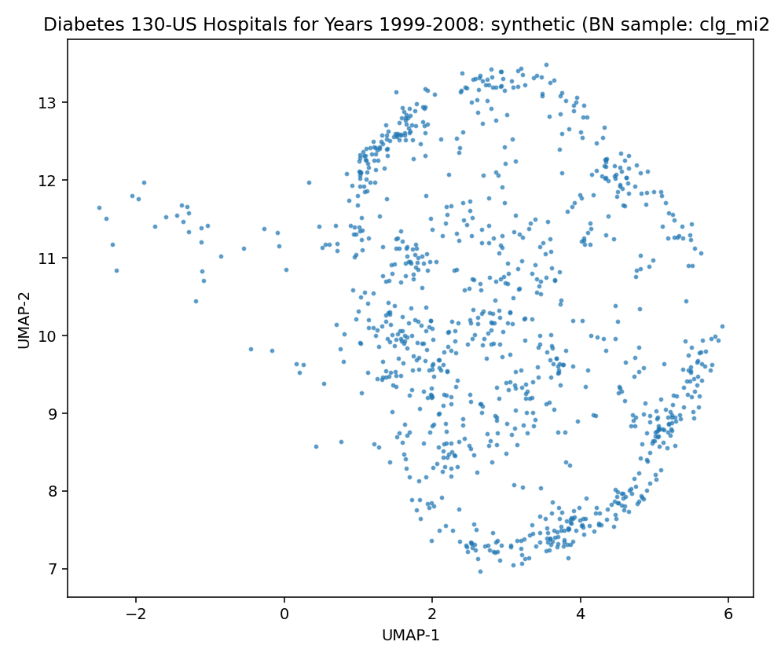
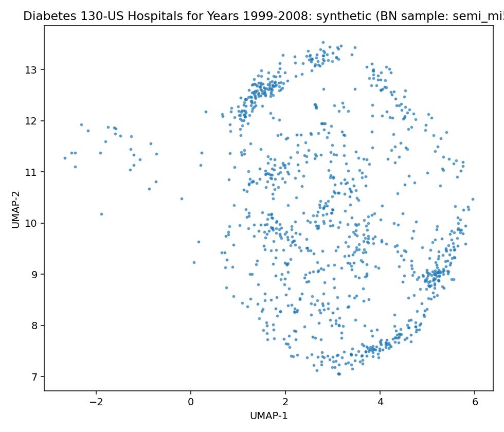

# Data Report — Diabetes 130-US Hospitals for Years 1999-2008

**Source**: [UCI dataset 296](https://archive.ics.uci.edu/dataset/296)

- Metadata file: [metadata.json](metadata.json)
- JSON-LD (schema.org/Dataset): [dataset.json](dataset.json)
- SemMap JSON-LD: [dataset.semmap.json](dataset.semmap.json)
- SemMap HTML: [dataset.semmap.html](dataset.semmap.html)
- Rows: 101766
- Columns: 48
- Discrete: 42  |  Continuous: 6

## Dataset metadata

- Name: UCI Diabetes 130-US hospitals (1999–2008)

### Description

The dataset represents ten years (1999-2008) of clinical care at 130 US hospitals and integrated delivery networks. Each row concerns hospital records of patients diagnosed with diabetes, who underwent laboratory, medications, and stayed up to 14 days. The goal is to determine the early readmission of the patient within 30 days of discharge.
The problem is important for the following reasons. Despite high-quality evidence showing improved clinical outcomes for diabetic patients who receive various preventive and therapeutic interventions, many patients do not receive them. This can be partially attributed to arbitrary diabetes management in hospital environments, which fail to attend to glycemic control. Failure to provide proper diabetes care not only increases the managing costs for the hospitals (as the patients are readmitted) but also impacts the morbidity and mortality of the patients, who may face complications associated with diabetes.

- Creators: John Clore, Krzysztof Cios, Jon DeShazo, Beata Strack
- Citation: Impact of HbA1c Measurement on Hospital Readmission Rates: Analysis of 70,000 Clinical Database Patient Record. Beata Strack, Jonathan DeShazo, Chris Gennings, Juan Olmo, Sebastian Ventura, Krzysztof Cios, John Clore. BioMed Research International, vol. 2014. 2014
- Links:
  - URL: https://archive.ics.uci.edu/dataset/296

## Metadata (rich)

[Standalone SemMap metadata view](dataset.semmap.html)

<!doctype html>
<html lang="en">
<head>
  <meta charset="utf-8">
  <meta name="viewport" content="width=device-width, initial-scale=1">
  <title>Diabetes 130-US Hospitals for Years 1999-2008 — SemMap metadata</title>
  
</head>
<body>
<h1>Diabetes 130-US Hospitals for Years 1999-2008 — SemMap metadata</h1>

dct:titleUCI Diabetes 130-US hospitals (1999–2008)

dct:source<a rel="dct:source" href="https://archive.ics.uci.edu/dataset/296/diabetes+130-us+hospitals+for+years+1999-2008">https://archive.ics.uci.edu/dataset/296/diabetes+130-us+hospitals+for+years+1999-2008</a>

disco:variable
<table class="prop-table" data-prop="disco:variable"><thead><tr><th>skos:notation</th><th>skos:prefLabel</th><th>dct:source</th><th>disco:representation</th></tr></thead><tr property="disco:variable" typeof="disco:Variable"><td>race</td><td>Race</td><td></td><td>

skos:hasTopConcept
<table class="prop-table" data-prop="skos:hasTopConcept"><thead><tr><th>skos:notation</th><th>skos:prefLabel</th></tr></thead><tr property="skos:hasTopConcept" typeof="skos:Concept"><td>Caucasian</td><td>Caucasian</td></tr><tr property="skos:hasTopConcept" typeof="skos:Concept"><td>AfricanAmerican</td><td>African American</td></tr><tr property="skos:hasTopConcept" typeof="skos:Concept"><td>Asian</td><td>Asian</td></tr><tr property="skos:hasTopConcept" typeof="skos:Concept"><td>Hispanic</td><td>Hispanic</td></tr><tr property="skos:hasTopConcept" typeof="skos:Concept"><td>Other</td><td>Other</td></tr><tr property="skos:hasTopConcept" typeof="skos:Concept"><td>Unknown/Invalid</td><td>Unknown/Invalid</td></tr></table>
</td></tr><tr property="disco:variable" typeof="disco:Variable"><td>gender</td><td>Administrative sex/gender</td><td></td><td>

skos:hasTopConcept
<table class="prop-table" data-prop="skos:hasTopConcept"><thead><tr><th>skos:notation</th><th>skos:prefLabel</th></tr></thead><tr property="skos:hasTopConcept" typeof="skos:Concept"><td>Male</td><td>Male</td></tr><tr property="skos:hasTopConcept" typeof="skos:Concept"><td>Female</td><td>Female</td></tr><tr property="skos:hasTopConcept" typeof="skos:Concept"><td>Unknown/Invalid</td><td>Unknown/Invalid</td></tr></table>
</td></tr><tr property="disco:variable" typeof="disco:Variable"><td>age</td><td>Age (10-year bins)</td><td></td><td>

skos:hasTopConcept
<table class="prop-table" data-prop="skos:hasTopConcept"><thead><tr><th>skos:notation</th><th>skos:prefLabel</th></tr></thead><tr property="skos:hasTopConcept" typeof="skos:Concept"><td>[0,10)</td><td>[0–10) years</td></tr><tr property="skos:hasTopConcept" typeof="skos:Concept"><td>[10,20)</td><td>[10–20) years</td></tr><tr property="skos:hasTopConcept" typeof="skos:Concept"><td>[20,30)</td><td>[20–30) years</td></tr><tr property="skos:hasTopConcept" typeof="skos:Concept"><td>[30,40)</td><td>[30–40) years</td></tr><tr property="skos:hasTopConcept" typeof="skos:Concept"><td>[40,50)</td><td>[40–50) years</td></tr><tr property="skos:hasTopConcept" typeof="skos:Concept"><td>[50,60)</td><td>[50–60) years</td></tr><tr property="skos:hasTopConcept" typeof="skos:Concept"><td>[60,70)</td><td>[60–70) years</td></tr><tr property="skos:hasTopConcept" typeof="skos:Concept"><td>[70,80)</td><td>[70–80) years</td></tr><tr property="skos:hasTopConcept" typeof="skos:Concept"><td>[80,90)</td><td>[80–90) years</td></tr><tr property="skos:hasTopConcept" typeof="skos:Concept"><td>[90,100)</td><td>[90–100) years</td></tr></table>
</td></tr><tr property="disco:variable" typeof="disco:Variable"><td>admission_type_id</td><td>Admission type (coded integer)</td><td></td><td>

dct:sourceIDS_mapping.csv (UCI dataset file)

skos:hasTopConcept
<table class="prop-table" data-prop="skos:hasTopConcept"><thead><tr><th>skos:notation</th><th>skos:prefLabel</th></tr></thead><tr property="skos:hasTopConcept" typeof="skos:Concept"><td>1</td><td>Emergency</td></tr><tr property="skos:hasTopConcept" typeof="skos:Concept"><td>2</td><td>Urgent</td></tr><tr property="skos:hasTopConcept" typeof="skos:Concept"><td>3</td><td>Elective</td></tr><tr property="skos:hasTopConcept" typeof="skos:Concept"><td>4</td><td>Newborn</td></tr><tr property="skos:hasTopConcept" typeof="skos:Concept"><td>5</td><td>Not Available</td></tr><tr property="skos:hasTopConcept" typeof="skos:Concept"><td>6</td><td>NULL</td></tr><tr property="skos:hasTopConcept" typeof="skos:Concept"><td>7</td><td>Trauma Center</td></tr><tr property="skos:hasTopConcept" typeof="skos:Concept"><td>8</td><td>Not Mapped</td></tr></table>
</td></tr><tr property="disco:variable" typeof="disco:Variable"><td>discharge_disposition_id</td><td>Discharge disposition (coded integer)</td><td></td><td>

dct:sourceIDS_mapping.csv (UCI dataset file)

</td></tr><tr property="disco:variable" typeof="disco:Variable"><td>admission_source_id</td><td>Admission source (coded integer)</td><td></td><td>

dct:sourceIDS_mapping.csv (UCI dataset file)

</td></tr><tr property="disco:variable" typeof="disco:Variable"><td>time_in_hospital</td><td>Length of stay (days)</td><td></td><td>
<h2 class="item-title">disco:Representation</h2>

dsv:valueType<a rel="dsv:valueType" href="http://www.w3.org/2001/XMLSchema#integer">http://www.w3.org/2001/XMLSchema#integer</a>

qudt:hasUnitunit:DAY

</td></tr><tr property="disco:variable" typeof="disco:Variable"><td>diag_1</td><td>Primary diagnosis (ICD-9-CM)</td><td></td><td>
<h2 class="item-title">disco:Representation</h2>

dsv:valueType<a rel="dsv:valueType" href="http://www.w3.org/2001/XMLSchema#string">http://www.w3.org/2001/XMLSchema#string</a>

dct:source<a rel="dct:source" href="http://hl7.org/fhir/sid/icd-9-cm">http://hl7.org/fhir/sid/icd-9-cm</a>

</td></tr><tr property="disco:variable" typeof="disco:Variable"><td>diag_2</td><td>Secondary diagnosis (ICD-9-CM)</td><td></td><td>
<h2 class="item-title">disco:Representation</h2>

dsv:valueType<a rel="dsv:valueType" href="http://www.w3.org/2001/XMLSchema#string">http://www.w3.org/2001/XMLSchema#string</a>

dct:source<a rel="dct:source" href="http://hl7.org/fhir/sid/icd-9-cm">http://hl7.org/fhir/sid/icd-9-cm</a>

</td></tr><tr property="disco:variable" typeof="disco:Variable"><td>diag_3</td><td>Tertiary diagnosis (ICD-9-CM)</td><td></td><td>
<h2 class="item-title">disco:Representation</h2>

dsv:valueType<a rel="dsv:valueType" href="http://www.w3.org/2001/XMLSchema#string">http://www.w3.org/2001/XMLSchema#string</a>

dct:source<a rel="dct:source" href="http://hl7.org/fhir/sid/icd-9-cm">http://hl7.org/fhir/sid/icd-9-cm</a>

</td></tr><tr property="disco:variable" typeof="disco:Variable"><td>max_glu_serum</td><td>Maximum glucose result (categorical)</td><td><a rel="dct:source" href="https://loinc.org/2345-7">https://loinc.org/2345-7</a></td><td>

skos:hasTopConcept
<table class="prop-table" data-prop="skos:hasTopConcept"><thead><tr><th>skos:notation</th><th>skos:prefLabel</th></tr></thead><tr property="skos:hasTopConcept" typeof="skos:Concept"><td>None</td><td>No test</td></tr><tr property="skos:hasTopConcept" typeof="skos:Concept"><td>Norm</td><td>Normal</td></tr><tr property="skos:hasTopConcept" typeof="skos:Concept"><td>&gt;200</td><td>&gt;200 mg/dL</td></tr><tr property="skos:hasTopConcept" typeof="skos:Concept"><td>&gt;300</td><td>&gt;300 mg/dL</td></tr></table>
</td></tr><tr property="disco:variable" typeof="disco:Variable"><td>A1Cresult</td><td>Hemoglobin A1c result (categorical)</td><td><a rel="dct:source" href="https://loinc.org/4548-4">https://loinc.org/4548-4</a></td><td>

skos:hasTopConcept
<table class="prop-table" data-prop="skos:hasTopConcept"><thead><tr><th>skos:notation</th><th>skos:prefLabel</th></tr></thead><tr property="skos:hasTopConcept" typeof="skos:Concept"><td>None</td><td>No test</td></tr><tr property="skos:hasTopConcept" typeof="skos:Concept"><td>Norm</td><td>Normal (&lt;7%)</td></tr><tr property="skos:hasTopConcept" typeof="skos:Concept"><td>&gt;7</td><td>&gt;7% and &lt;8%</td></tr><tr property="skos:hasTopConcept" typeof="skos:Concept"><td>&gt;8</td><td>≥8%</td></tr></table>
</td></tr><tr property="disco:variable" typeof="disco:Variable"><td>metformin</td><td>Metformin therapy status</td><td><a rel="dct:source" href="http://purl.bioontology.org/ontology/RXNORM/6809">http://purl.bioontology.org/ontology/RXNORM/6809</a></td><td>

skos:hasTopConcept
<table class="prop-table" data-prop="skos:hasTopConcept"><thead><tr><th>skos:notation</th><th>skos:prefLabel</th></tr></thead><tr property="skos:hasTopConcept" typeof="skos:Concept"><td>No</td><td>Not prescribed</td></tr><tr property="skos:hasTopConcept" typeof="skos:Concept"><td>Steady</td><td>Dose steady</td></tr><tr property="skos:hasTopConcept" typeof="skos:Concept"><td>Up</td><td>Dose increased</td></tr><tr property="skos:hasTopConcept" typeof="skos:Concept"><td>Down</td><td>Dose decreased</td></tr></table>
</td></tr><tr property="disco:variable" typeof="disco:Variable"><td>glipizide</td><td>Glipizide therapy status</td><td><a rel="dct:source" href="http://purl.bioontology.org/ontology/RXNORM/4821">http://purl.bioontology.org/ontology/RXNORM/4821</a></td><td>

skos:hasTopConcept
<table class="prop-table" data-prop="skos:hasTopConcept"><thead><tr><th>skos:notation</th><th>skos:prefLabel</th></tr></thead><tr property="skos:hasTopConcept" typeof="skos:Concept"><td>No</td><td>Not prescribed</td></tr><tr property="skos:hasTopConcept" typeof="skos:Concept"><td>Steady</td><td>Dose steady</td></tr><tr property="skos:hasTopConcept" typeof="skos:Concept"><td>Up</td><td>Dose increased</td></tr><tr property="skos:hasTopConcept" typeof="skos:Concept"><td>Down</td><td>Dose decreased</td></tr></table>
</td></tr><tr property="disco:variable" typeof="disco:Variable"><td>glyburide</td><td>Glyburide therapy status</td><td><a rel="dct:source" href="http://purl.bioontology.org/ontology/RXNORM/4815">http://purl.bioontology.org/ontology/RXNORM/4815</a></td><td>

skos:hasTopConcept
<table class="prop-table" data-prop="skos:hasTopConcept"><thead><tr><th>skos:notation</th><th>skos:prefLabel</th></tr></thead><tr property="skos:hasTopConcept" typeof="skos:Concept"><td>No</td><td>Not prescribed</td></tr><tr property="skos:hasTopConcept" typeof="skos:Concept"><td>Steady</td><td>Dose steady</td></tr><tr property="skos:hasTopConcept" typeof="skos:Concept"><td>Up</td><td>Dose increased</td></tr><tr property="skos:hasTopConcept" typeof="skos:Concept"><td>Down</td><td>Dose decreased</td></tr></table>
</td></tr><tr property="disco:variable" typeof="disco:Variable"><td>pioglitazone</td><td>Pioglitazone therapy status</td><td><a rel="dct:source" href="http://purl.bioontology.org/ontology/RXNORM/33738">http://purl.bioontology.org/ontology/RXNORM/33738</a></td><td>

skos:hasTopConcept
<table class="prop-table" data-prop="skos:hasTopConcept"><thead><tr><th>skos:notation</th><th>skos:prefLabel</th></tr></thead><tr property="skos:hasTopConcept" typeof="skos:Concept"><td>No</td><td>Not prescribed</td></tr><tr property="skos:hasTopConcept" typeof="skos:Concept"><td>Steady</td><td>Dose steady</td></tr><tr property="skos:hasTopConcept" typeof="skos:Concept"><td>Up</td><td>Dose increased</td></tr><tr property="skos:hasTopConcept" typeof="skos:Concept"><td>Down</td><td>Dose decreased</td></tr></table>
</td></tr><tr property="disco:variable" typeof="disco:Variable"><td>insulin</td><td>Insulin therapy status</td><td></td><td>

skos:hasTopConcept
<table class="prop-table" data-prop="skos:hasTopConcept"><thead><tr><th>skos:notation</th><th>skos:prefLabel</th></tr></thead><tr property="skos:hasTopConcept" typeof="skos:Concept"><td>No</td><td>Not prescribed</td></tr><tr property="skos:hasTopConcept" typeof="skos:Concept"><td>Steady</td><td>Dose steady</td></tr><tr property="skos:hasTopConcept" typeof="skos:Concept"><td>Up</td><td>Dose increased</td></tr><tr property="skos:hasTopConcept" typeof="skos:Concept"><td>Down</td><td>Dose decreased</td></tr></table>
</td></tr><tr property="disco:variable" typeof="disco:Variable"><td>readmitted</td><td>Readmitted status</td><td></td><td>

skos:hasTopConcept
<table class="prop-table" data-prop="skos:hasTopConcept"><thead><tr><th>skos:notation</th><th>skos:prefLabel</th></tr></thead><tr property="skos:hasTopConcept" typeof="skos:Concept"><td>&lt;30</td><td>Readmitted &lt;30 days</td></tr><tr property="skos:hasTopConcept" typeof="skos:Concept"><td>&gt;30</td><td>Readmitted &gt;30 days</td></tr><tr property="skos:hasTopConcept" typeof="skos:Concept"><td>NO</td><td>Not readmitted</td></tr></table>
</td></tr></table>

</body>
</html>

## Variables and summary

| variable                 | description                                                                                                                                                                                                                                                          | inferred   | declared    |   count | unique   | top              | freq   | mean                | std                | min   | 25%   | 50%   | 75%   | max   |
|:-------------------------|:---------------------------------------------------------------------------------------------------------------------------------------------------------------------------------------------------------------------------------------------------------------------|:-----------|:------------|--------:|:---------|:-----------------|:-------|:--------------------|:-------------------|:------|:------|:------|:------|:------|
| race                     | Values: Caucasian, Asian, African American, Hispanic, and other                                                                                                                                                                                                      | discrete   | Categorical |   99493 | 5        | Caucasian        | 76099  |                     |                    |       |       |       |       |       |
| gender                   | Values: male, female, and unknown/invalid                                                                                                                                                                                                                            | discrete   | Categorical |  101766 | 3        | Female           | 54708  |                     |                    |       |       |       |       |       |
| age                      | Grouped in 10-year intervals: [0, 10), [10, 20),..., [90, 100)                                                                                                                                                                                                       | discrete   | Categorical |  101766 | 10       | [70-80)          | 26068  |                     |                    |       |       |       |       |       |
| weight                   | Weight in pounds.                                                                                                                                                                                                                                                    | discrete   | Categorical |    3197 | 9        | [75-100)         | 1336   |                     |                    |       |       |       |       |       |
| admission_type_id        | Integer identifier corresponding to 9 distinct values, for example, emergency, urgent, elective, newborn, and not available                                                                                                                                          | discrete   | Categorical |  101766 | 8        | 1                | 53990  |                     |                    |       |       |       |       |       |
| discharge_disposition_id | Integer identifier corresponding to 29 distinct values, for example, discharged to home, expired, and not available                                                                                                                                                  | continuous | Categorical |  101766 |          |                  |        | 3.7156417664052825  | 5.280165509302918  | 1.0   | 1.0   | 1.0   | 4.0   | 28.0  |
| admission_source_id      | Integer identifier corresponding to 21 distinct values, for example, physician referral, emergency room, and transfer from a hospital                                                                                                                                | discrete   | Categorical |  101766 | 17       | 7                | 57494  |                     |                    |       |       |       |       |       |
| time_in_hospital         | Integer number of days between admission and discharge                                                                                                                                                                                                               | discrete   | Integer     |  101766 | 14       | 3                | 17756  |                     |                    |       |       |       |       |       |
| payer_code               | Integer identifier corresponding to 23 distinct values, for example, Blue Cross/Blue Shield, Medicare, and self-pay                                                                                                                                                  | discrete   | Categorical |   61510 | 17       | MC               | 32439  |                     |                    |       |       |       |       |       |
| medical_specialty        | Integer identifier of a specialty of the admitting physician, corresponding to 84 distinct values, for example, cardiology, internal medicine, family/general practice, and surgeon                                                                                  | discrete   | Categorical |   51817 | 72       | InternalMedicine | 14635  |                     |                    |       |       |       |       |       |
| num_lab_procedures       | Number of lab tests performed during the encounter                                                                                                                                                                                                                   | continuous | Integer     |  101766 |          |                  |        | 43.09564098028811   | 19.67436224914256  | 1.0   | 31.0  | 44.0  | 57.0  | 132.0 |
| num_procedures           | Number of procedures (other than lab tests) performed during the encounter                                                                                                                                                                                           | discrete   | Integer     |  101766 | 7        | 0                | 46652  |                     |                    |       |       |       |       |       |
| num_medications          | Number of distinct generic names administered during the encounter                                                                                                                                                                                                   | continuous | Integer     |  101766 |          |                  |        | 16.021844230882614  | 8.127566209166169  | 1.0   | 10.0  | 15.0  | 20.0  | 81.0  |
| number_outpatient        | Number of outpatient visits of the patient in the year preceding the encounter                                                                                                                                                                                       | continuous | Integer     |  101766 |          |                  |        | 0.36935715268360747 | 1.2672650965325358 | 0.0   | 0.0   | 0.0   | 0.0   | 42.0  |
| number_emergency         | Number of emergency visits of the patient in the year preceding the encounter                                                                                                                                                                                        | continuous | Integer     |  101766 |          |                  |        | 0.19783621248747127 | 0.9304722684223071 | 0.0   | 0.0   | 0.0   | 0.0   | 76.0  |
| number_inpatient         | Number of inpatient visits of the patient in the year preceding the encounter                                                                                                                                                                                        | continuous | Integer     |  101766 |          |                  |        | 0.635565906098304   | 1.2628632900971597 | 0.0   | 0.0   | 0.0   | 1.0   | 21.0  |
| diag_1                   | The primary diagnosis (coded as first three digits of ICD9); 848 distinct values                                                                                                                                                                                     | discrete   | Categorical |  101745 | 716      | 428              | 6862   |                     |                    |       |       |       |       |       |
| diag_2                   | Secondary diagnosis (coded as first three digits of ICD9); 923 distinct values                                                                                                                                                                                       | discrete   | Categorical |  101408 | 748      | 276              | 6752   |                     |                    |       |       |       |       |       |
| diag_3                   | Additional secondary diagnosis (coded as first three digits of ICD9); 954 distinct values                                                                                                                                                                            | discrete   | Categorical |  100343 | 789      | 250              | 11555  |                     |                    |       |       |       |       |       |
| number_diagnoses         | Number of diagnoses entered to the system                                                                                                                                                                                                                            | discrete   | Integer     |  101766 | 16       | 9                | 49474  |                     |                    |       |       |       |       |       |
| max_glu_serum            | Indicates the range of the result or if the test was not taken. Values: >200, >300, normal, and none if not measured                                                                                                                                                 | discrete   | Categorical |    5346 | 3        | Norm             | 2597   |                     |                    |       |       |       |       |       |
| A1Cresult                | Indicates the range of the result or if the test was not taken. Values: >8 if the result was greater than 8%, >7 if the result was greater than 7% but less than 8%, normal if the result was less than 7%, and none if not measured.                                | discrete   | Categorical |   17018 | 3        | >8               | 8216   |                     |                    |       |       |       |       |       |
| metformin                | The feature indicates whether the drug was prescribed or there was a change in the dosage. Values: up if the dosage was increased during the encounter, down if the dosage was decreased, steady if the dosage did not change, and no if the drug was not prescribed | discrete   | Categorical |  101766 | 4        | No               | 81778  |                     |                    |       |       |       |       |       |
| repaglinide              | The feature indicates whether the drug was prescribed or there was a change in the dosage. Values: up if the dosage was increased during the encounter, down if the dosage was decreased, steady if the dosage did not change, and no if the drug was not prescribed | discrete   | Categorical |  101766 | 4        | No               | 100227 |                     |                    |       |       |       |       |       |
| nateglinide              | The feature indicates whether the drug was prescribed or there was a change in the dosage. Values: up if the dosage was increased during the encounter, down if the dosage was decreased, steady if the dosage did not change, and no if the drug was not prescribed | discrete   | Categorical |  101766 | 4        | No               | 101063 |                     |                    |       |       |       |       |       |
| chlorpropamide           | The feature indicates whether the drug was prescribed or there was a change in the dosage. Values: up if the dosage was increased during the encounter, down if the dosage was decreased, steady if the dosage did not change, and no if the drug was not prescribed | discrete   | Categorical |  101766 | 4        | No               | 101680 |                     |                    |       |       |       |       |       |
| glimepiride              | The feature indicates whether the drug was prescribed or there was a change in the dosage. Values: up if the dosage was increased during the encounter, down if the dosage was decreased, steady if the dosage did not change, and no if the drug was not prescribed | discrete   | Categorical |  101766 | 4        | No               | 96575  |                     |                    |       |       |       |       |       |
| acetohexamide            | The feature indicates whether the drug was prescribed or there was a change in the dosage. Values: up if the dosage was increased during the encounter, down if the dosage was decreased, steady if the dosage did not change, and no if the drug was not prescribed | discrete   | Categorical |  101766 | 2        | No               | 101765 |                     |                    |       |       |       |       |       |
| glipizide                | The feature indicates whether the drug was prescribed or there was a change in the dosage. Values: up if the dosage was increased during the encounter, down if the dosage was decreased, steady if the dosage did not change, and no if the drug was not prescribed | discrete   | Categorical |  101766 | 4        | No               | 89080  |                     |                    |       |       |       |       |       |
| glyburide                | The feature indicates whether the drug was prescribed or there was a change in the dosage. Values: up if the dosage was increased during the encounter, down if the dosage was decreased, steady if the dosage did not change, and no if the drug was not prescribed | discrete   | Categorical |  101766 | 4        | No               | 91116  |                     |                    |       |       |       |       |       |
| tolbutamide              | The feature indicates whether the drug was prescribed or there was a change in the dosage. Values: up if the dosage was increased during the encounter, down if the dosage was decreased, steady if the dosage did not change, and no if the drug was not prescribed | discrete   | Categorical |  101766 | 2        | No               | 101743 |                     |                    |       |       |       |       |       |
| pioglitazone             | The feature indicates whether the drug was prescribed or there was a change in the dosage. Values: up if the dosage was increased during the encounter, down if the dosage was decreased, steady if the dosage did not change, and no if the drug was not prescribed | discrete   | Categorical |  101766 | 4        | No               | 94438  |                     |                    |       |       |       |       |       |
| rosiglitazone            | The feature indicates whether the drug was prescribed or there was a change in the dosage. Values: up if the dosage was increased during the encounter, down if the dosage was decreased, steady if the dosage did not change, and no if the drug was not prescribed | discrete   | Categorical |  101766 | 4        | No               | 95401  |                     |                    |       |       |       |       |       |
| acarbose                 | The feature indicates whether the drug was prescribed or there was a change in the dosage. Values: up if the dosage was increased during the encounter, down if the dosage was decreased, steady if the dosage did not change, and no if the drug was not prescribed | discrete   | Categorical |  101766 | 4        | No               | 101458 |                     |                    |       |       |       |       |       |
| miglitol                 | The feature indicates whether the drug was prescribed or there was a change in the dosage. Values: up if the dosage was increased during the encounter, down if the dosage was decreased, steady if the dosage did not change, and no if the drug was not prescribed | discrete   | Categorical |  101766 | 4        | No               | 101728 |                     |                    |       |       |       |       |       |
| troglitazone             | The feature indicates whether the drug was prescribed or there was a change in the dosage. Values: up if the dosage was increased during the encounter, down if the dosage was decreased, steady if the dosage did not change, and no if the drug was not prescribed | discrete   | Categorical |  101766 | 2        | No               | 101763 |                     |                    |       |       |       |       |       |
| tolazamide               | The feature indicates whether the drug was prescribed or there was a change in the dosage. Values: up if the dosage was increased during the encounter, down if the dosage was decreased, steady if the dosage did not change, and no if the drug was not prescribed | discrete   | Categorical |  101766 | 3        | No               | 101727 |                     |                    |       |       |       |       |       |
| examide                  | The feature indicates whether the drug was prescribed or there was a change in the dosage. Values: up if the dosage was increased during the encounter, down if the dosage was decreased, steady if the dosage did not change, and no if the drug was not prescribed | discrete   | Categorical |  101766 | 1        | No               | 101766 |                     |                    |       |       |       |       |       |
| citoglipton              | The feature indicates whether the drug was prescribed or there was a change in the dosage. Values: up if the dosage was increased during the encounter, down if the dosage was decreased, steady if the dosage did not change, and no if the drug was not prescribed | discrete   | Categorical |  101766 | 1        | No               | 101766 |                     |                    |       |       |       |       |       |
| insulin                  | The feature indicates whether the drug was prescribed or there was a change in the dosage. Values: up if the dosage was increased during the encounter, down if the dosage was decreased, steady if the dosage did not change, and no if the drug was not prescribed | discrete   | Categorical |  101766 | 4        | No               | 47383  |                     |                    |       |       |       |       |       |
| glyburide-metformin      | The feature indicates whether the drug was prescribed or there was a change in the dosage. Values: up if the dosage was increased during the encounter, down if the dosage was decreased, steady if the dosage did not change, and no if the drug was not prescribed | discrete   | Categorical |  101766 | 4        | No               | 101060 |                     |                    |       |       |       |       |       |
| glipizide-metformin      | The feature indicates whether the drug was prescribed or there was a change in the dosage. Values: up if the dosage was increased during the encounter, down if the dosage was decreased, steady if the dosage did not change, and no if the drug was not prescribed | discrete   | Categorical |  101766 | 2        | No               | 101753 |                     |                    |       |       |       |       |       |
| glimepiride-pioglitazone | The feature indicates whether the drug was prescribed or there was a change in the dosage. Values: up if the dosage was increased during the encounter, down if the dosage was decreased, steady if the dosage did not change, and no if the drug was not prescribed | discrete   | Categorical |  101766 | 2        | No               | 101765 |                     |                    |       |       |       |       |       |
| metformin-rosiglitazone  | The feature indicates whether the drug was prescribed or there was a change in the dosage. Values: up if the dosage was increased during the encounter, down if the dosage was decreased, steady if the dosage did not change, and no if the drug was not prescribed | discrete   | Categorical |  101766 | 2        | No               | 101764 |                     |                    |       |       |       |       |       |
| metformin-pioglitazone   | The feature indicates whether the drug was prescribed or there was a change in the dosage. Values: up if the dosage was increased during the encounter, down if the dosage was decreased, steady if the dosage did not change, and no if the drug was not prescribed | discrete   | Categorical |  101766 | 2        | No               | 101765 |                     |                    |       |       |       |       |       |
| change                   | Indicates if there was a change in diabetic medications (either dosage or generic name). Values: change and no change                                                                                                                                                | discrete   | Categorical |  101766 | 2        | No               | 54755  |                     |                    |       |       |       |       |       |
| diabetesMed              | Indicates if there was any diabetic medication prescribed. Values: yes and no                                                                                                                                                                                        | discrete   | Categorical |  101766 | 2        | Yes              | 78363  |                     |                    |       |       |       |       |       |
| readmitted               | Days to inpatient readmission. Values: <30 if the patient was readmitted in less than 30 days, >30 if the patient was readmitted in more than 30 days, and No for no record of readmission.                                                                          | discrete   | Categorical |  101766 | 3        | NO               | 54864  |                     |                    |       |       |       |       |       |

## Learned structures and configurations

MetaSyn GMF: [metasyn_gmf.json](metasyn_gmf.json)

MetaSyn serialization

- Synthetic sample (SemMap Parquet): [synthetic_metasyn.semmap.parquet](synthetic_metasyn.semmap.parquet)

### Arc blacklist

- Root variables: race, gender, age
- Forbidden arc count: 144

### clg_mi2

| param        | value    |
|:-------------|:---------|
| bn_type      | clg      |
| score        | bic      |
| operators    | ['arcs'] |
| max_indegree | 2        |
| seed         | 42       |

Serialization

- Structure (GraphML): [structure_clg_mi2.graphml](structure_clg_mi2.graphml)
- Full model (pickle): [model_clg_mi2.pickle](model_clg_mi2.pickle)

### semi_mi5

| param        | value          |
|:-------------|:---------------|
| bn_type      | semiparametric |
| score        | bic            |
| operators    | ['arcs']       |
| max_indegree | 5              |
| seed         | 42             |

Serialization

- Structure (GraphML): [structure_semi_mi5.graphml](structure_semi_mi5.graphml)
- Full model (pickle): [model_semi_mi5.pickle](model_semi_mi5.pickle)

## Fidelity (BN vs MetaSyn)

| model       | mean_loglik   | std_loglik   | sum_loglik   |   disc_jsd_mean |   disc_jsd_median |   cont_ks_mean |   cont_w1_mean |
|:------------|:--------------|:-------------|:-------------|----------------:|------------------:|---------------:|---------------:|
| BN:clg_mi2  | -46.958       | 18.5634      | -950100.6021 |          0.0425 |            0.0218 |         0.296  |         1.151  |
| BN:semi_mi5 | -46.6902      | 22.2258      | -944076.5847 |          0.0401 |            0.0197 |         0.2853 |         1.1736 |
| MetaSyn     |               |              |              |          0.0402 |            0.0175 |         0.5203 |         0.91   |

### Per-variable distances (lower is closer)

<table class="dataframe table per-var-dist">
  <thead>
    <tr>
      <th colspan="2" halign="left"></th>
      <th colspan="3" halign="left">JSD</th>
      <th colspan="3" halign="left">KS</th>
      <th colspan="3" halign="left">W1</th>
    </tr>
    <tr>
      <th>variable</th>
      <th>type</th>
      <th>clg_mi2</th>
      <th>semi_mi5</th>
      <th>MetaSyn</th>
      <th>clg_mi2</th>
      <th>semi_mi5</th>
      <th>MetaSyn</th>
      <th>clg_mi2</th>
      <th>semi_mi5</th>
      <th>MetaSyn</th>
    </tr>
  </thead>
  <tbody>
    <tr>
      <td>A1Cresult</td>
      <td>discrete</td>
      <td>0.0311</td>
      <td>0.0311</td>
      <td>0.0179</td>
      <td></td>
      <td></td>
      <td></td>
      <td></td>
      <td></td>
      <td></td>
    </tr>
    <tr>
      <td>acarbose</td>
      <td>discrete</td>
      <td>0.0138</td>
      <td>0.0138</td>
      <td>0.0077</td>
      <td></td>
      <td></td>
      <td></td>
      <td></td>
      <td></td>
      <td></td>
    </tr>
    <tr>
      <td>acetohexamide</td>
      <td>discrete</td>
      <td>0.0384</td>
      <td>0.0384</td>
      <td>0.0336</td>
      <td></td>
      <td></td>
      <td></td>
      <td></td>
      <td></td>
      <td></td>
    </tr>
    <tr>
      <td>admission_source_id</td>
      <td>discrete</td>
      <td>0.0478</td>
      <td>0.0409</td>
      <td>0.0280</td>
      <td></td>
      <td></td>
      <td></td>
      <td></td>
      <td></td>
      <td></td>
    </tr>
    <tr>
      <td>admission_type_id</td>
      <td>discrete</td>
      <td>0.0379</td>
      <td>0.0379</td>
      <td>0.0261</td>
      <td></td>
      <td></td>
      <td></td>
      <td></td>
      <td></td>
      <td></td>
    </tr>
    <tr>
      <td>age</td>
      <td>discrete</td>
      <td></td>
      <td></td>
      <td></td>
      <td>0.3110</td>
      <td>0.3060</td>
      <td>0.5869</td>
      <td>2.7973</td>
      <td>2.8217</td>
      <td>1.5351</td>
    </tr>
    <tr>
      <td>change</td>
      <td>discrete</td>
      <td>0.0436</td>
      <td>0.0436</td>
      <td>0.0430</td>
      <td></td>
      <td></td>
      <td></td>
      <td></td>
      <td></td>
      <td></td>
    </tr>
    <tr>
      <td>chlorpropamide</td>
      <td>discrete</td>
      <td>0.0479</td>
      <td>0.0305</td>
      <td>0.0308</td>
      <td></td>
      <td></td>
      <td></td>
      <td></td>
      <td></td>
      <td></td>
    </tr>
    <tr>
      <td>citoglipton</td>
      <td>discrete</td>
      <td>0.0461</td>
      <td>0.0461</td>
      <td>0.0591</td>
      <td></td>
      <td></td>
      <td></td>
      <td></td>
      <td></td>
      <td></td>
    </tr>
    <tr>
      <td>diabetesMed</td>
      <td>discrete</td>
      <td>0.1099</td>
      <td>0.1099</td>
      <td>0.1019</td>
      <td></td>
      <td></td>
      <td></td>
      <td></td>
      <td></td>
      <td></td>
    </tr>
    <tr>
      <td>diag_1</td>
      <td>discrete</td>
      <td></td>
      <td></td>
      <td></td>
      <td>0.0724</td>
      <td>0.0642</td>
      <td>0.0575</td>
      <td>1.7419</td>
      <td>1.8480</td>
      <td>2.1134</td>
    </tr>
    <tr>
      <td>diag_2</td>
      <td>discrete</td>
      <td>0.0255</td>
      <td>0.0255</td>
      <td>0.0394</td>
      <td></td>
      <td></td>
      <td></td>
      <td></td>
      <td></td>
      <td></td>
    </tr>
    <tr>
      <td>diag_3</td>
      <td>discrete</td>
      <td></td>
      <td></td>
      <td></td>
      <td>0.0515</td>
      <td>0.0456</td>
      <td>0.0869</td>
      <td>0.5075</td>
      <td>0.6187</td>
      <td>0.7701</td>
    </tr>
    <tr>
      <td>discharge_disposition_id</td>
      <td>continuous</td>
      <td></td>
      <td></td>
      <td></td>
      <td>0.4686</td>
      <td>0.4466</td>
      <td>0.8356</td>
      <td>0.8125</td>
      <td>0.7564</td>
      <td>0.3986</td>
    </tr>
    <tr>
      <td>examide</td>
      <td>discrete</td>
      <td></td>
      <td></td>
      <td></td>
      <td>0.4891</td>
      <td>0.4821</td>
      <td>0.8901</td>
      <td>0.5183</td>
      <td>0.4936</td>
      <td>0.2532</td>
    </tr>
    <tr>
      <td>gender</td>
      <td>discrete</td>
      <td></td>
      <td></td>
      <td></td>
      <td>0.3836</td>
      <td>0.3676</td>
      <td>0.6646</td>
      <td>0.5283</td>
      <td>0.5031</td>
      <td>0.3895</td>
    </tr>
    <tr>
      <td>glimepiride</td>
      <td>discrete</td>
      <td>0.2890</td>
      <td>0.2890</td>
      <td>0.3041</td>
      <td></td>
      <td></td>
      <td></td>
      <td></td>
      <td></td>
      <td></td>
    </tr>
    <tr>
      <td>glimepiride-pioglitazone</td>
      <td>discrete</td>
      <td>0.2747</td>
      <td>0.2747</td>
      <td>0.2793</td>
      <td></td>
      <td></td>
      <td></td>
      <td></td>
      <td></td>
      <td></td>
    </tr>
    <tr>
      <td>glipizide</td>
      <td>discrete</td>
      <td>0.2838</td>
      <td>0.2838</td>
      <td>0.3016</td>
      <td></td>
      <td></td>
      <td></td>
      <td></td>
      <td></td>
      <td></td>
    </tr>
    <tr>
      <td>glipizide-metformin</td>
      <td>discrete</td>
      <td>0.0387</td>
      <td>0.0387</td>
      <td>0.0573</td>
      <td></td>
      <td></td>
      <td></td>
      <td></td>
      <td></td>
      <td></td>
    </tr>
    <tr>
      <td>glyburide</td>
      <td>discrete</td>
      <td>0.0219</td>
      <td>0.0228</td>
      <td>0.0108</td>
      <td></td>
      <td></td>
      <td></td>
      <td></td>
      <td></td>
      <td></td>
    </tr>
    <tr>
      <td>glyburide-metformin</td>
      <td>discrete</td>
      <td>0.0132</td>
      <td>0.0184</td>
      <td>0.0171</td>
      <td></td>
      <td></td>
      <td></td>
      <td></td>
      <td></td>
      <td></td>
    </tr>
    <tr>
      <td>insulin</td>
      <td>discrete</td>
      <td>0.0226</td>
      <td>0.0130</td>
      <td>0.0112</td>
      <td></td>
      <td></td>
      <td></td>
      <td></td>
      <td></td>
      <td></td>
    </tr>
    <tr>
      <td>max_glu_serum</td>
      <td>discrete</td>
      <td>0.0427</td>
      <td>0.0273</td>
      <td>0.0267</td>
      <td></td>
      <td></td>
      <td></td>
      <td></td>
      <td></td>
      <td></td>
    </tr>
    <tr>
      <td>medical_specialty</td>
      <td>discrete</td>
      <td>0.0693</td>
      <td>0.0414</td>
      <td>0.0217</td>
      <td></td>
      <td></td>
      <td></td>
      <td></td>
      <td></td>
      <td></td>
    </tr>
    <tr>
      <td>metformin</td>
      <td>discrete</td>
      <td>0.0210</td>
      <td>0.0210</td>
      <td>0.0142</td>
      <td></td>
      <td></td>
      <td></td>
      <td></td>
      <td></td>
      <td></td>
    </tr>
    <tr>
      <td>metformin-pioglitazone</td>
      <td>discrete</td>
      <td>0.0277</td>
      <td>0.0450</td>
      <td>0.0203</td>
      <td></td>
      <td></td>
      <td></td>
      <td></td>
      <td></td>
      <td></td>
    </tr>
    <tr>
      <td>metformin-rosiglitazone</td>
      <td>discrete</td>
      <td>0.0000</td>
      <td>0.0000</td>
      <td>0.0000</td>
      <td></td>
      <td></td>
      <td></td>
      <td></td>
      <td></td>
      <td></td>
    </tr>
    <tr>
      <td>miglitol</td>
      <td>discrete</td>
      <td>0.0217</td>
      <td>0.0252</td>
      <td>0.0328</td>
      <td></td>
      <td></td>
      <td></td>
      <td></td>
      <td></td>
      <td></td>
    </tr>
    <tr>
      <td>nateglinide</td>
      <td>discrete</td>
      <td>0.0196</td>
      <td>0.0231</td>
      <td>0.0199</td>
      <td></td>
      <td></td>
      <td></td>
      <td></td>
      <td></td>
      <td></td>
    </tr>
    <tr>
      <td>num_lab_procedures</td>
      <td>continuous</td>
      <td>0.0086</td>
      <td>0.0086</td>
      <td>0.0086</td>
      <td></td>
      <td></td>
      <td></td>
      <td></td>
      <td></td>
      <td></td>
    </tr>
    <tr>
      <td>num_medications</td>
      <td>continuous</td>
      <td>0.0131</td>
      <td>0.0156</td>
      <td>0.0366</td>
      <td></td>
      <td></td>
      <td></td>
      <td></td>
      <td></td>
      <td></td>
    </tr>
    <tr>
      <td>num_procedures</td>
      <td>discrete</td>
      <td>0.0309</td>
      <td>0.0129</td>
      <td>0.0171</td>
      <td></td>
      <td></td>
      <td></td>
      <td></td>
      <td></td>
      <td></td>
    </tr>
    <tr>
      <td>number_diagnoses</td>
      <td>discrete</td>
      <td>0.0118</td>
      <td>0.0099</td>
      <td>0.0099</td>
      <td></td>
      <td></td>
      <td></td>
      <td></td>
      <td></td>
      <td></td>
    </tr>
    <tr>
      <td>number_emergency</td>
      <td>continuous</td>
      <td>0.0140</td>
      <td>0.0140</td>
      <td>0.0140</td>
      <td></td>
      <td></td>
      <td></td>
      <td></td>
      <td></td>
      <td></td>
    </tr>
    <tr>
      <td>number_inpatient</td>
      <td>continuous</td>
      <td>0.0000</td>
      <td>0.0000</td>
      <td>0.0000</td>
      <td></td>
      <td></td>
      <td></td>
      <td></td>
      <td></td>
      <td></td>
    </tr>
    <tr>
      <td>number_outpatient</td>
      <td>continuous</td>
      <td>0.0110</td>
      <td>0.0110</td>
      <td>0.0216</td>
      <td></td>
      <td></td>
      <td></td>
      <td></td>
      <td></td>
      <td></td>
    </tr>
    <tr>
      <td>payer_code</td>
      <td>discrete</td>
      <td>0.0000</td>
      <td>0.0000</td>
      <td>0.0000</td>
      <td></td>
      <td></td>
      <td></td>
      <td></td>
      <td></td>
      <td></td>
    </tr>
    <tr>
      <td>pioglitazone</td>
      <td>discrete</td>
      <td>0.0000</td>
      <td>0.0000</td>
      <td>0.0000</td>
      <td></td>
      <td></td>
      <td></td>
      <td></td>
      <td></td>
      <td></td>
    </tr>
    <tr>
      <td>race</td>
      <td>discrete</td>
      <td>0.0232</td>
      <td>0.0240</td>
      <td>0.0147</td>
      <td></td>
      <td></td>
      <td></td>
      <td></td>
      <td></td>
      <td></td>
    </tr>
    <tr>
      <td>readmitted</td>
      <td>discrete</td>
      <td>0.0069</td>
      <td>0.0151</td>
      <td>0.0069</td>
      <td></td>
      <td></td>
      <td></td>
      <td></td>
      <td></td>
      <td></td>
    </tr>
    <tr>
      <td>repaglinide</td>
      <td>discrete</td>
      <td>0.0050</td>
      <td>0.0050</td>
      <td>0.0050</td>
      <td></td>
      <td></td>
      <td></td>
      <td></td>
      <td></td>
      <td></td>
    </tr>
    <tr>
      <td>rosiglitazone</td>
      <td>discrete</td>
      <td>0.0000</td>
      <td>0.0000</td>
      <td>0.0000</td>
      <td></td>
      <td></td>
      <td></td>
      <td></td>
      <td></td>
      <td></td>
    </tr>
    <tr>
      <td>time_in_hospital</td>
      <td>discrete</td>
      <td>0.0000</td>
      <td>0.0000</td>
      <td>0.0000</td>
      <td></td>
      <td></td>
      <td></td>
      <td></td>
      <td></td>
      <td></td>
    </tr>
    <tr>
      <td>tolazamide</td>
      <td>discrete</td>
      <td>0.0000</td>
      <td>0.0000</td>
      <td>0.0000</td>
      <td></td>
      <td></td>
      <td></td>
      <td></td>
      <td></td>
      <td></td>
    </tr>
    <tr>
      <td>tolbutamide</td>
      <td>discrete</td>
      <td>0.0148</td>
      <td>0.0148</td>
      <td>0.0089</td>
      <td></td>
      <td></td>
      <td></td>
      <td></td>
      <td></td>
      <td></td>
    </tr>
    <tr>
      <td>troglitazone</td>
      <td>discrete</td>
      <td>0.0403</td>
      <td>0.0047</td>
      <td>0.0245</td>
      <td></td>
      <td></td>
      <td></td>
      <td></td>
      <td></td>
      <td></td>
    </tr>
    <tr>
      <td>weight</td>
      <td>discrete</td>
      <td>0.0171</td>
      <td>0.0078</td>
      <td>0.0162</td>
      <td></td>
      <td></td>
      <td></td>
      <td></td>
      <td></td>
      <td></td>
    </tr>
  </tbody>
</table>

## UMAP overview (same projection)

| Real (sample) | MetaSyn (synthetic) | BN: clg_mi2 | BN: semi_mi5 |
| --- | --- | --- | --- |
|  |  |  |  |

