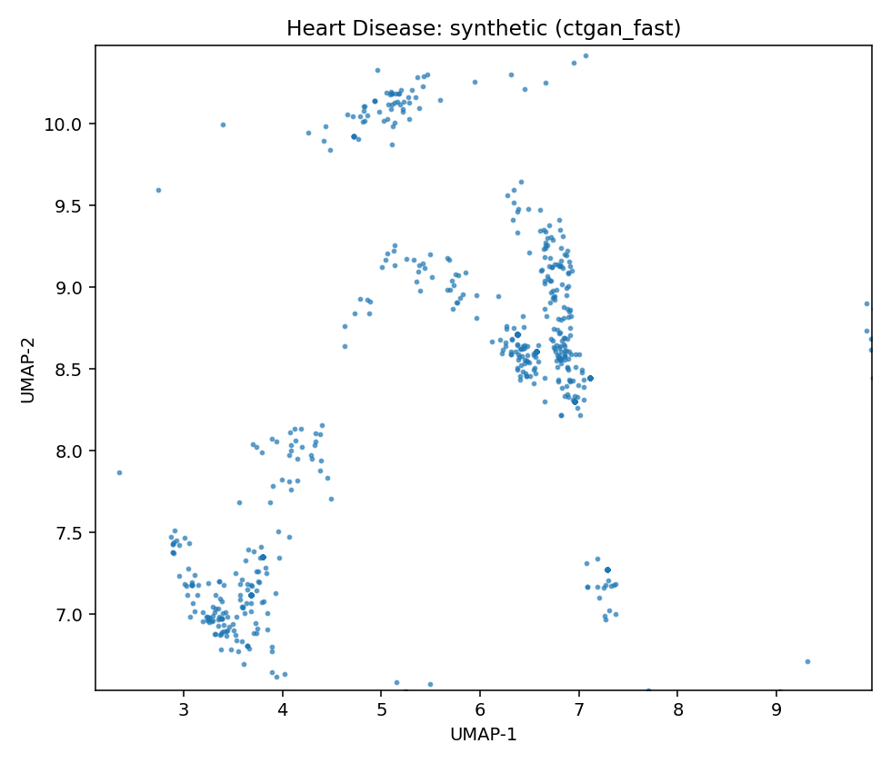

# Data Report — Heart Disease

**Source**: [UCI dataset 45](https://archive.ics.uci.edu/dataset/45)

- SemMap JSON-LD: [dataset.semmap.json](dataset.semmap.json)
- SemMap HTML: [dataset.semmap.html](dataset.semmap.html)
- Rows: 297
- Columns: 14
- Discrete: 9  |  Continuous: 5

## Variables and summary

| variable   | inferred   | dist                                         |
|:-----------|:-----------|:---------------------------------------------|
| age        | continuous | 54.5421 ± 9.0497 [29, 48, 56, 61, 77]        |
| sex        | discrete   | 201 (67.68%)                                 |
| cp         | discrete   | 4: 142 (47.81%)                              |
|            |            | 3: 83 (27.95%)                               |
|            |            | 2: 49 (16.50%)                               |
|            |            | 1: 23 (7.74%)                                |
| trestbps   | continuous | 131.6936 ± 17.7628 [94, 120, 130, 140, 200]  |
| chol       | continuous | 247.3502 ± 51.9976 [126, 211, 243, 276, 564] |
| fbs        | discrete   | 43 (14.48%)                                  |
| restecg    | discrete   | 0: 147 (49.49%)                              |
|            |            | 2: 146 (49.16%)                              |
|            |            | 1: 4 (1.35%)                                 |
| thalach    | continuous | 149.5993 ± 22.9416 [71, 133, 153, 166, 202]  |
| exang      | discrete   | 97 (32.66%)                                  |
| oldpeak    | continuous | 1.0556 ± 1.1661 [0, 0, 0.8, 1.6, 6.2]        |
| slope      | discrete   | 1: 139 (46.80%)                              |
|            |            | 2: 137 (46.13%)                              |
|            |            | 3: 21 (7.07%)                                |
| ca         | discrete   | 0: 174 (58.59%)                              |
|            |            | 1: 65 (21.89%)                               |
|            |            | 2: 38 (12.79%)                               |
|            |            | 3: 20 (6.73%)                                |
| thal       | discrete   | 3: 164 (55.22%)                              |
|            |            | 7: 115 (38.72%)                              |
|            |            | 6: 18 (6.06%)                                |
| num        | discrete   | 0: 160 (53.87%)                              |
|            |            | 1: 54 (18.18%)                               |
|            |            | 2: 35 (11.78%)                               |
|            |            | 3: 35 (11.78%)                               |
|            |            | 4: 13 (4.38%)                                |

## Fidelity summary

| model      | backend   |   disc_jsd_mean |   disc_jsd_median |   cont_ks_mean |   cont_w1_mean |
|:-----------|:----------|----------------:|------------------:|---------------:|---------------:|
| clg_mi2    | pybnesian |          0.1003 |            0.0995 |         0.2344 |         4.4109 |
| semi_mi5   | pybnesian |          0.1003 |            0.0995 |         0.2344 |         4.4109 |
| ctgan_fast | synthcity |          0.4269 |            0.4085 |         0.686  |        30.8935 |
| tvae_quick | synthcity |          0.1021 |            0.1128 |         0.2007 |         6.072  |

## Models

<table>
<tr><th>UMAP</th><th>Details</th><th>Structure</th></tr>
<tr><td></td><td><h3>Real data</h3></td><td></td></tr>
<tr><td>
</td><td>

<h3>Model: clg_mi2 (pybnesian)</h3>
<ul>
<li>Seed: 42, rows: 237</li>
<li>Params: <code>{"max_indegree": 2, "operators": ["arcs"], "score": "bic", "type": "clg"}</code></li>
<li><a href="models/clg_mi2/synthetic.csv">Synthetic CSV</a></li>
<li><a href="models/clg_mi2/per_variable_metrics.csv">Per-variable metrics</a></li>
<li><a href="models/clg_mi2/metrics.json">Metrics JSON</a></li>
</ul></td><td>

</td></tr>

<tr><td>
</td><td>

<h3>Model: semi_mi5 (pybnesian)</h3>
<ul>
<li>Seed: 42, rows: 237</li>
<li>Params: <code>{"max_indegree": 5, "operators": ["arcs"], "score": "bic", "type": "semiparametric"}</code></li>
<li><a href="models/semi_mi5/synthetic.csv">Synthetic CSV</a></li>
<li><a href="models/semi_mi5/per_variable_metrics.csv">Per-variable metrics</a></li>
<li><a href="models/semi_mi5/metrics.json">Metrics JSON</a></li>
</ul></td><td>

</td></tr>

<tr><td>
</td><td>

<h3>Model: ctgan_fast (synthcity)</h3>
<ul>
<li>Seed: 42, rows: 1000</li>
<li>Params: <code>{"batch_size": 256, "n_iter": 5}</code></li>
<li><a href="models/ctgan_fast/synthetic.csv">Synthetic CSV</a></li>
<li><a href="models/ctgan_fast/per_variable_metrics.csv">Per-variable metrics</a></li>
<li><a href="models/ctgan_fast/metrics.json">Metrics JSON</a></li>
</ul></td><td>

</td></tr>

<tr><td>
</td><td>

<h3>Model: tvae_quick (synthcity)</h3>
<ul>
<li>Seed: 42, rows: 1000</li>
<li>Params: <code>{"batch_size": 256}</code></li>
<li><a href="models/tvae_quick/synthetic.csv">Synthetic CSV</a></li>
<li><a href="models/tvae_quick/per_variable_metrics.csv">Per-variable metrics</a></li>
<li><a href="models/tvae_quick/metrics.json">Metrics JSON</a></li>
</ul></td><td>

</td></tr>

<table>

