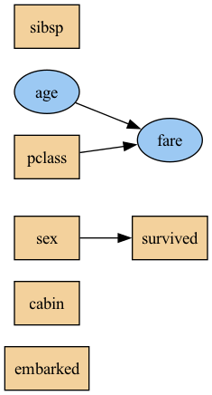
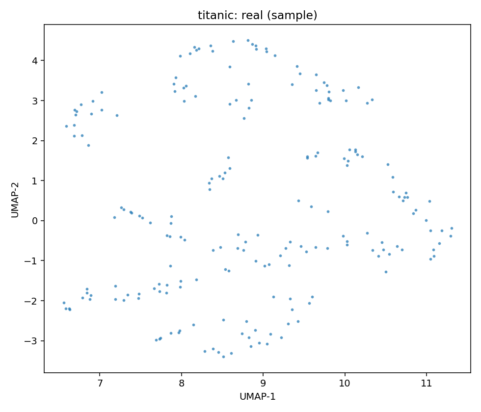
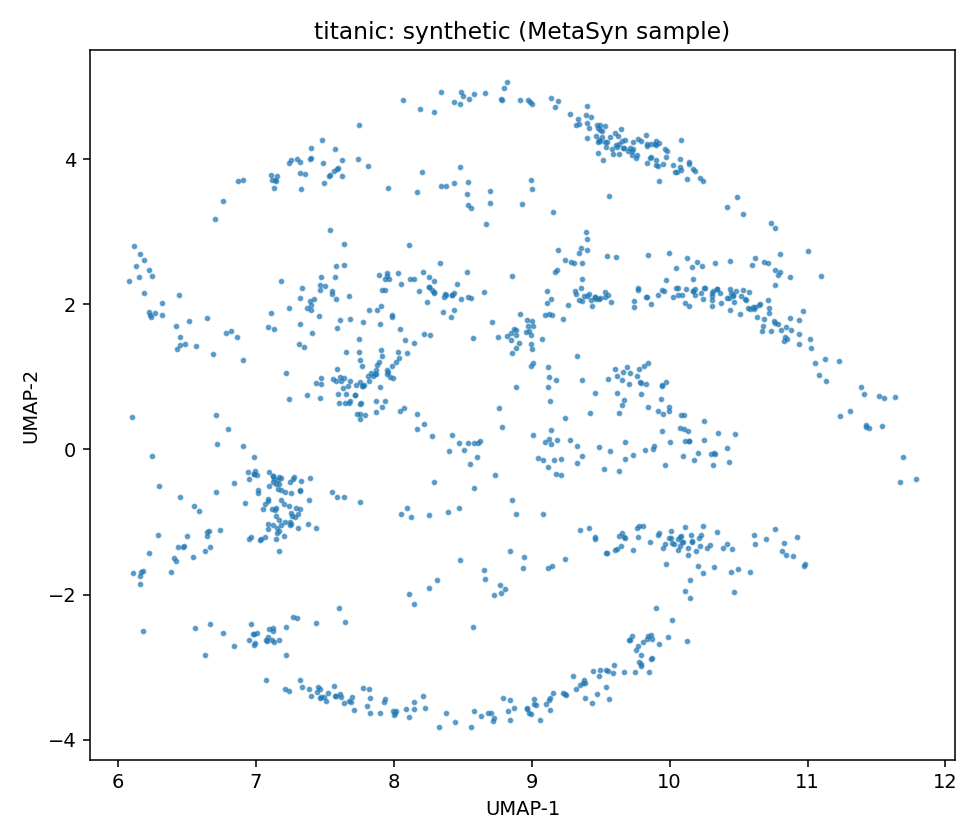
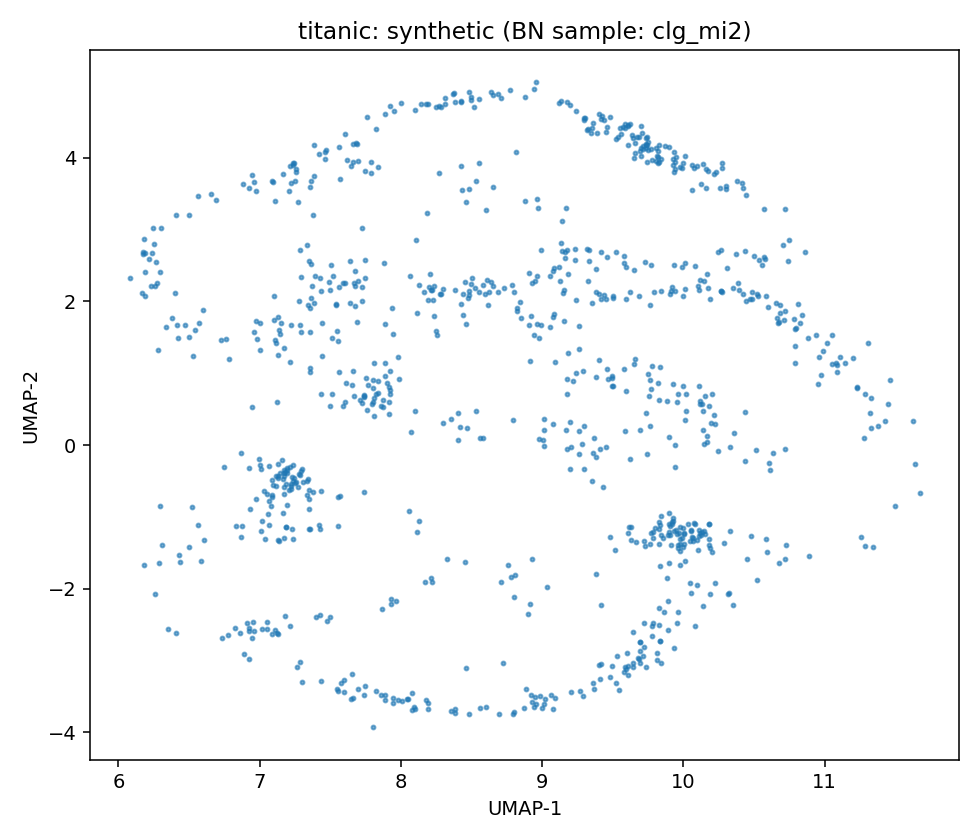

# Data Report — titanic

**Source**: [OpenML dataset 42638](https://www.openml.org/search?type=data&id=42638)

- Metadata file: [metadata.json](metadata.json)
- JSON-LD (schema.org/Dataset): [dataset.json](dataset.json)
- Rows: 202
- Columns: 8
- Discrete: 6  |  Continuous: 2

## Dataset metadata

### Description

xxx

- Date: 2020-09-04T03:56:00
- Links:
  - URL: https://api.openml.org/data/v1/download/22044399/titanic.arff
## Variables and summary

| variable   | inferred   |   count | unique   | top         | freq   | mean               | std                | min   | 25%    | 50%     | 75%   | max      |
|:-----------|:-----------|--------:|:---------|:------------|:-------|:-------------------|:-------------------|:------|:-------|:--------|:------|:---------|
| pclass     | discrete   |     891 | 3        | 3           | 491    |                    |                    |       |        |         |       |          |
| sex        | discrete   |     891 | 2        | male        | 577    |                    |                    |       |        |         |       |          |
| age        | continuous |     891 |          |             |        | 29.758888888888887 | 13.00257003982093  | 0.42  | 22.0   | 30.0    | 35.0  | 80.0     |
| sibsp      | discrete   |     891 | 7        | 0           | 608    |                    |                    |       |        |         |       |          |
| fare       | continuous |     891 |          |             |        | 32.204207968574636 | 49.693428597180905 | 0.0   | 7.9104 | 14.4542 | 31.0  | 512.3292 |
| cabin      | discrete   |     204 | 147      | C23 C25 C27 | 4      |                    |                    |       |        |         |       |          |
| embarked   | discrete   |     889 | 3        | S           | 644    |                    |                    |       |        |         |       |          |
| survived   | discrete   |     891 | 2        | 0           | 549    |                    |                    |       |        |         |       |          |

## Learned structures and configurations

MetaSyn GMF: [metasyn_gmf.json](metasyn_gmf.json)

### Arc blacklist

- Root variables: age, sex
- Forbidden arc count: 16

### clg_mi2

| param        | value    |
|:-------------|:---------|
| bn_type      | clg      |
| score        | bic      |
| operators    | ['arcs'] |
| max_indegree | 2        |
| seed         | 42       |

Serialization

- Structure (GraphML): [structure_clg_mi2.graphml](structure_clg_mi2.graphml)
- Full model (pickle): [model_clg_mi2.pickle](model_clg_mi2.pickle)

### semi_mi5

| param        | value          |
|:-------------|:---------------|
| bn_type      | semiparametric |
| score        | bic            |
| operators    | ['arcs']       |
| max_indegree | 5              |
| seed         | 42             |

Serialization

- Structure (GraphML): [structure_semi_mi5.graphml](structure_semi_mi5.graphml)
- Full model (pickle): [model_semi_mi5.pickle](model_semi_mi5.pickle)

## Fidelity (BN vs MetaSyn)

| model       | mean_loglik   | std_loglik   | sum_loglik   |   disc_jsd_mean |   disc_jsd_median |   cont_ks_mean |   cont_w1_mean |
|:------------|:--------------|:-------------|:-------------|----------------:|------------------:|---------------:|---------------:|
| BN:clg_mi2  | -19.7419      | 5.0633       | -394.8386    |          0.2633 |            0.1696 |         0.2353 |        20.1207 |
| BN:semi_mi5 | -19.7419      | 5.0633       | -394.8386    |          0.2633 |            0.1696 |         0.2353 |        20.1207 |
| MetaSyn     |               |              |              |          0.2702 |            0.171  |         0.2449 |        16.3138 |

### Per-variable distances (lower is closer)

<table class="dataframe table per-var-dist">
  <thead>
    <tr>
      <th colspan="2" halign="left"></th>
      <th colspan="3" halign="left">JSD</th>
      <th colspan="3" halign="left">KS</th>
      <th colspan="3" halign="left">W1</th>
    </tr>
    <tr>
      <th>variable</th>
      <th>type</th>
      <th>clg_mi2</th>
      <th>semi_mi5</th>
      <th>MetaSyn</th>
      <th>clg_mi2</th>
      <th>semi_mi5</th>
      <th>MetaSyn</th>
      <th>clg_mi2</th>
      <th>semi_mi5</th>
      <th>MetaSyn</th>
    </tr>
  </thead>
  <tbody>
    <tr>
      <td>age</td>
      <td>continuous</td>
      <td>0.1902</td>
      <td>0.1902</td>
      <td>0.1967</td>
      <td></td>
      <td></td>
      <td></td>
      <td></td>
      <td></td>
      <td></td>
    </tr>
    <tr>
      <td>cabin</td>
      <td>discrete</td>
      <td>0.1331</td>
      <td>0.1331</td>
      <td>0.1237</td>
      <td></td>
      <td></td>
      <td></td>
      <td></td>
      <td></td>
      <td></td>
    </tr>
    <tr>
      <td>embarked</td>
      <td>discrete</td>
      <td></td>
      <td></td>
      <td></td>
      <td>0.1994</td>
      <td>0.1994</td>
      <td>0.2094</td>
      <td>3.9885</td>
      <td>3.9885</td>
      <td>3.6116</td>
    </tr>
    <tr>
      <td>fare</td>
      <td>continuous</td>
      <td>0.1594</td>
      <td>0.1594</td>
      <td>0.1674</td>
      <td></td>
      <td></td>
      <td></td>
      <td></td>
      <td></td>
      <td></td>
    </tr>
    <tr>
      <td>pclass</td>
      <td>discrete</td>
      <td></td>
      <td></td>
      <td></td>
      <td>0.2712</td>
      <td>0.2712</td>
      <td>0.2805</td>
      <td>36.2528</td>
      <td>36.2528</td>
      <td>29.0160</td>
    </tr>
    <tr>
      <td>sex</td>
      <td>discrete</td>
      <td>0.8730</td>
      <td>0.8730</td>
      <td>0.8813</td>
      <td></td>
      <td></td>
      <td></td>
      <td></td>
      <td></td>
      <td></td>
    </tr>
    <tr>
      <td>sibsp</td>
      <td>discrete</td>
      <td>0.0444</td>
      <td>0.0444</td>
      <td>0.0773</td>
      <td></td>
      <td></td>
      <td></td>
      <td></td>
      <td></td>
      <td></td>
    </tr>
    <tr>
      <td>survived</td>
      <td>discrete</td>
      <td>0.1798</td>
      <td>0.1798</td>
      <td>0.1746</td>
      <td></td>
      <td></td>
      <td></td>
      <td></td>
      <td></td>
      <td></td>
    </tr>
  </tbody>
</table>

## UMAP overview (same projection)

| Real (sample) | MetaSyn (synthetic) | BN: clg_mi2 | BN: semi_mi5 |
| --- | --- | --- | --- |
|  |  |  |  |

