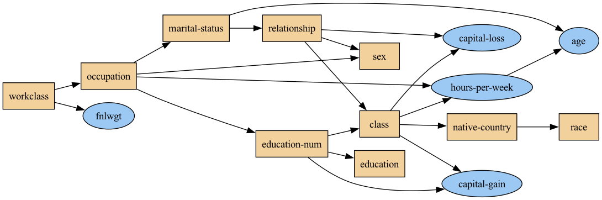
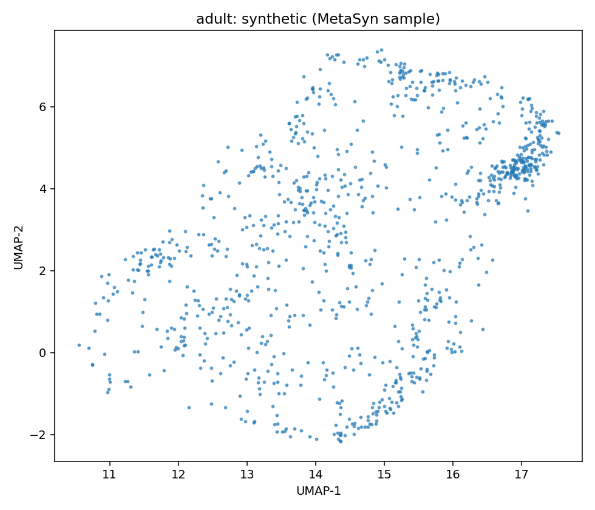
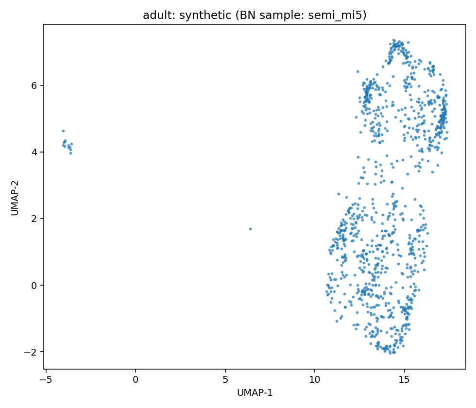

# Data Report — adult

- Metadata file: [metadata.json](metadata.json)
- JSON-LD (schema.org/Dataset): [dataset.jsonld](dataset.jsonld)
- Rows: 48842
- Columns: 15
- Discrete: 10  |  Continuous: 5

## Dataset metadata

### Description

Prediction task is to determine whether a person makes over 50K a year. Extraction was done by Barry Becker from the 1994 Census database. A set of reasonably clean records was extracted using the following conditions: ((AAGE>16) && (AGI>100) && (AFNLWGT>1)&& (HRSWK>0))

- Creators: Yoontae Hwang, Youngbin Lee, Yongjae Lee
- Date: 2023-01-27T11:26:07
- Citation: Yoontae Hwang, Youngbin Lee, Yongjae Lee,Semi-Supervised Learning for Tabular Datasets with Continuous and Categorical Variables, Archive, 2023
- Links:
  - URL: https://api.openml.org/data/v1/download/22112026/adult.arff

### Variables

| variable       | measurement   | unit   |
|:---------------|:--------------|:-------|
| age            | continuous    |        |
| fnlwgt         | continuous    |        |
| education-num  | discrete      |        |
| capital-gain   | continuous    |        |
| capital-loss   | continuous    |        |
| hours-per-week | continuous    |        |
| workclass      | discrete      |        |
| education      | discrete      |        |
| marital-status | discrete      |        |
| occupation     | discrete      |        |
| relationship   | discrete      |        |
| race           | discrete      |        |
| sex            | discrete      |        |
| native-country | discrete      |        |
| class          | discrete      |        |

## Baseline summary

| variable       |   count | unique   | top                | freq   | mean               | std                | min     | 25%      | 50%      | 75%      | max       |
|:---------------|--------:|:---------|:-------------------|:-------|:-------------------|:-------------------|:--------|:---------|:---------|:---------|:----------|
| age            |   48842 |          |                    |        | 38.64358543876172  | 13.71050993444316  | 17.0    | 28.0     | 37.0     | 48.0     | 90.0      |
| fnlwgt         |   48842 |          |                    |        | 189664.13459727284 | 105604.02542315786 | 12285.0 | 117550.5 | 178144.5 | 237642.0 | 1490400.0 |
| education-num  |   48842 | 16       | 9                  | 15784  |                    |                    |         |          |          |          |           |
| capital-gain   |   48842 |          |                    |        | 1079.0676262233324 | 7452.01905765375   | 0.0     | 0.0      | 0.0      | 0.0      | 99999.0   |
| capital-loss   |   48842 |          |                    |        | 87.50231358257237  | 403.00455212445047 | 0.0     | 0.0      | 0.0      | 0.0      | 4356.0    |
| hours-per-week |   48842 |          |                    |        | 40.422382375824085 | 12.391444024255906 | 1.0     | 40.0     | 40.0     | 45.0     | 99.0      |
| workclass      |   48842 | 9        | Private            | 33906  |                    |                    |         |          |          |          |           |
| education      |   48842 | 16       | HS-grad            | 15784  |                    |                    |         |          |          |          |           |
| marital-status |   48842 | 7        | Married-civ-spouse | 22379  |                    |                    |         |          |          |          |           |
| occupation     |   48842 | 15       | Prof-specialty     | 6172   |                    |                    |         |          |          |          |           |
| relationship   |   48842 | 6        | Husband            | 19716  |                    |                    |         |          |          |          |           |
| race           |   48842 | 5        | White              | 41762  |                    |                    |         |          |          |          |           |
| sex            |   48842 | 2        | Male               | 32650  |                    |                    |         |          |          |          |           |
| native-country |   48842 | 42       | United-States      | 43832  |                    |                    |         |          |          |          |           |
| class          |   48842 | 2        | <=50K              | 37155  |                    |                    |         |          |          |          |           |

## Learned BN structures and configurations

### Arc blacklist

- Sensitive variables: age, sex, race
- Rule: forbid parent arcs from sensitive to non-sensitive
- Forbidden arc count: 36

### clg_mi2

| param        | value    |
|:-------------|:---------|
| bn_type      | clg      |
| score        | bic      |
| operators    | ['arcs'] |
| max_indegree | 2        |
| seed         | 42       |

Serialization

- Structure (GraphML): [structure_clg_mi2.graphml](structure_clg_mi2.graphml)
- Full model (pickle): [model_clg_mi2.pickle](model_clg_mi2.pickle)

### semi_mi5

| param        | value          |
|:-------------|:---------------|
| bn_type      | semiparametric |
| score        | bic            |
| operators    | ['arcs']       |
| max_indegree | 5              |
| seed         | 42             |

Serialization

- Structure (GraphML): [structure_semi_mi5.graphml](structure_semi_mi5.graphml)
- Full model (pickle): [model_semi_mi5.pickle](model_semi_mi5.pickle)

MetaSyn GMF: [metasyn_gmf.json](metasyn_gmf.json)

## Fidelity (BN vs MetaSyn)

| model       | mean_loglik   | std_loglik   | sum_loglik   |   disc_jsd_mean |   disc_jsd_median |   cont_ks_mean |   cont_w1_mean |
|:------------|:--------------|:-------------|:-------------|----------------:|------------------:|---------------:|---------------:|
| BN:clg_mi2  |               |              |              |          0.0448 |            0.039  |         0.3069 |        4640.47 |
| BN:semi_mi5 |               |              |              |          0.0412 |            0.0383 |         0.3071 |        4657.79 |
| MetaSyn     |               |              |              |          0.0465 |            0.0384 |         0.4609 |        4431.66 |

### Per-variable distances (lower is closer)

| variable       | type       | ('clg_mi2', 'JSD')   | ('clg_mi2', 'KS')   | ('clg_mi2', 'W1')   | ('semi_mi5', 'JSD')   | ('semi_mi5', 'KS')   | ('semi_mi5', 'W1')   | ('MetaSyn', 'JSD')   | ('MetaSyn', 'KS')   | ('MetaSyn', 'W1')   |
|:---------------|:-----------|:---------------------|:--------------------|:--------------------|:----------------------|:---------------------|:---------------------|:---------------------|:--------------------|:--------------------|
| age            | continuous |                      | 0.0717              | 1.4076              |                       | 0.0657               | 1.4928               |                      | 0.0539              | 0.7069              |
| capital-gain   | continuous |                      | 0.1317              | 20454.9604          |                       | 0.1317               | 20454.9604           |                      | 0.1174              | 20378.4254          |
| capital-loss   | continuous | 0.0612               |                     |                     | 0.0463                |                      |                      | 0.0709               |                     |                     |
| class          | discrete   |                      | 0.5206              | 2443.3109           |                       | 0.5166               | 2527.8571            |                      | 0.9106              | 1632.6689           |
| education      | discrete   |                      | 0.564               | 299.3094            |                       | 0.566                | 301.2509             |                      | 0.952               | 142.792             |
| education-num  | discrete   |                      | 0.2466              | 3.347               |                       | 0.2556               | 3.3923               |                      | 0.2706              | 3.7094              |
| fnlwgt         | continuous | 0.0272               |                     |                     | 0.0272                |                      |                      | 0.0395               |                     |                     |
| hours-per-week | continuous | 0.0612               |                     |                     | 0.0463                |                      |                      | 0.0887               |                     |                     |
| marital-status | discrete   | 0.0369               |                     |                     | 0.0369                |                      |                      | 0.0372               |                     |                     |
| native-country | discrete   | 0.052                |                     |                     | 0.052                 |                      |                      | 0.0545               |                     |                     |
| occupation     | discrete   | 0.0274               |                     |                     | 0.0274                |                      |                      | 0.0284               |                     |                     |
| race           | discrete   | 0.0411               |                     |                     | 0.0397                |                      |                      | 0.0138               |                     |                     |
| relationship   | discrete   | 0.0191               |                     |                     | 0.0191                |                      |                      | 0.0033               |                     |                     |
| sex            | discrete   | 0.0934               |                     |                     | 0.096                 |                      |                      | 0.1065               |                     |                     |
| workclass      | discrete   | 0.0289               |                     |                     | 0.0207                |                      |                      | 0.0228               |                     |                     |

## UMAP overview (same projection)

| Real (sample) | MetaSyn (synthetic) | BN: clg_mi2 | BN: semi_mi5 |
| --- | --- | --- | --- |
|  |  |  |  |

