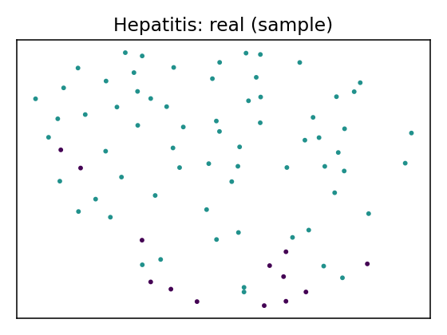
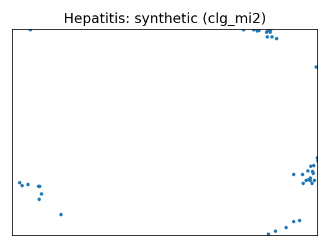
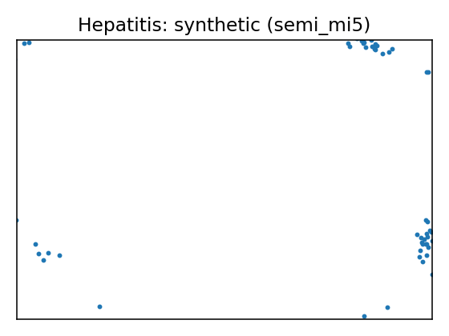

# Data Report — Hepatitis

**Source**: [UCI dataset 46](https://archive.ics.uci.edu/dataset/46)

- SemMap JSON-LD: [dataset.semmap.json](dataset.semmap.json)
- SemMap HTML: [dataset.semmap.html](dataset.semmap.html)
- Rows: 80
- Columns: 20
- Discrete: 14  |  Continuous: 6

## Variables and summary

| variable        | inferred   | dist                                             |
|:----------------|:-----------|:-------------------------------------------------|
| Age             | continuous | 40.6625 ± 11.2800 [20, 32, 38.5, 49.25, 72]      |
| Sex             | discrete   | 69 (86.25%)                                      |
| Steroid         | discrete   | 38 (47.50%)                                      |
| Antivirals      | discrete   | 21 (26.25%)                                      |
| Fatigue         | discrete   | 52 (65.00%)                                      |
| Malaise         | discrete   | 31 (38.75%)                                      |
| Anorexia        | discrete   | 12 (15.00%)                                      |
| Liver Big       | discrete   | 13 (16.25%)                                      |
| Liver Firm      | discrete   | 38 (47.50%)                                      |
| Spleen Palpable | discrete   | 15 (18.75%)                                      |
| Spiders         | discrete   | 25 (31.25%)                                      |
| Ascites         | discrete   | 12 (15.00%)                                      |
| Varices         | discrete   | 10 (12.50%)                                      |
| Bilirubin       | continuous | 1.2212 ± 0.8752 [0.3, 0.7, 1, 1.3, 4.8]          |
| Alk Phosphate   | continuous | 102.9125 ± 53.6848 [26, 68.25, 85, 133.5, 280]   |
| Sgot            | continuous | 82.0250 ± 71.6000 [14, 30.75, 56.5, 102.75, 420] |
| Albumin         | continuous | 3.8438 ± 0.5763 [2.1, 3.5, 4, 4.2, 5]            |
| Protime         | continuous | 62.5125 ± 23.4278 [0, 46, 62, 77.25, 100]        |
| Histology       | discrete   | 47 (58.75%)                                      |
| Class           | discrete   | 13 (16.25%)                                      |

## Fidelity summary

| model    | backend   |   disc_jsd_mean |   disc_jsd_median |   cont_ks_mean |   cont_w1_mean |
|:---------|:----------|----------------:|------------------:|---------------:|---------------:|
| metasyn  | metasyn   |          0.1228 |            0.1106 |         0.2177 |         9.2615 |
| clg_mi2  | pybnesian |          0.1287 |            0.1415 |         0.2147 |         9.5402 |
| semi_mi5 | pybnesian |          0.1251 |            0.1495 |         0.2134 |        11.509  |

## Models

<table>
<tr><th>UMAP</th><th>Details</th><th>Structure</th></tr>
<tr><td></td><td><h3>Real data</h3></td><td></td></tr>
<tr><td>
</td><td>

<h3>Model: metasyn (metasyn)</h3>
<ul>
<li>Seed: 42, rows: 155</li>
<li><a href="models/metasyn/synthetic.csv">Synthetic CSV</a></li>
<li><a href="models/metasyn/per_variable_metrics.csv">Per-variable metrics</a></li>
<li><a href="models/metasyn/metrics.json">Metrics JSON</a></li>
</ul></td><td>

</td></tr>

<tr><td>
</td><td>

<h3>Model: clg_mi2 (pybnesian)</h3>
<ul>
<li>Seed: 42, rows: 155</li>
<li>Params: <code>{"max_indegree": 2, "operators": ["arcs"], "score": "bic", "type": "clg"}</code></li>
<li><a href="models/clg_mi2/synthetic.csv">Synthetic CSV</a></li>
<li><a href="models/clg_mi2/per_variable_metrics.csv">Per-variable metrics</a></li>
<li><a href="models/clg_mi2/metrics.json">Metrics JSON</a></li>
</ul></td><td>

</td></tr>

<tr><td>
</td><td>

<h3>Model: semi_mi5 (pybnesian)</h3>
<ul>
<li>Seed: 42, rows: 155</li>
<li>Params: <code>{"max_indegree": 5, "operators": ["arcs"], "score": "bic", "type": "semiparametric"}</code></li>
<li><a href="models/semi_mi5/synthetic.csv">Synthetic CSV</a></li>
<li><a href="models/semi_mi5/per_variable_metrics.csv">Per-variable metrics</a></li>
<li><a href="models/semi_mi5/metrics.json">Metrics JSON</a></li>
</ul></td><td>

</td></tr>

<table>

